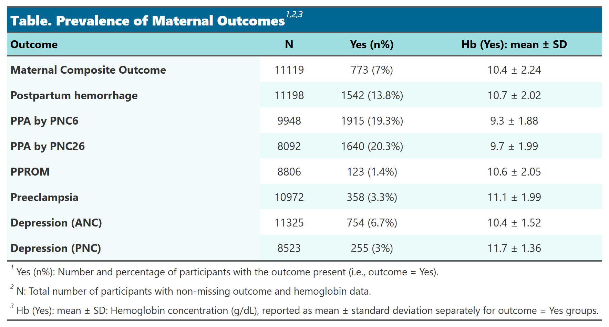
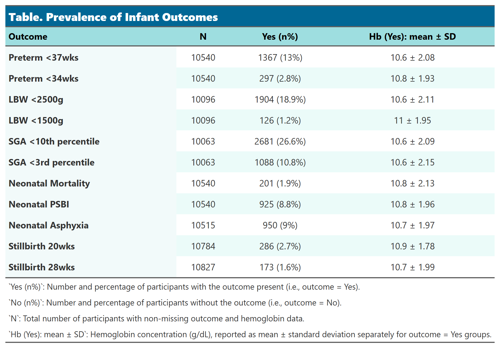

**Date of included data upload to Synapse:** 2025-04-18

\tableofcontents

```{r setup, include=FALSE}
knitr::opts_chunk$set(echo = FALSE, warning = FALSE, message = FALSE)
knitr::opts_chunk$set(fig.width = 5, fig.height = 4, fig.align = "center")
# Core reporting and table packages
library(rmarkdown)
library(knitr)
library(officer)
library(flextable)
library(gt)

# Data wrangling and visualization
library(tidyverse)
library(ggrepel)
library(wesanderson)
library(ggbreak)
library(VennDiagram)

# Statistical modeling
library(rms)

# Data import/export
library(haven)
library(webshot2)

UploadDate = "2025-04-18"

setwd(file.path("D:/Users/williams_pj/Documents/Analysis/ReMAPP/Aim2", UploadDate))

load("derived_data/df_hb_3type.rda")
load("derived_data/df_hb_long.rda")
load("derived_data/df_anemia_complet_preg.rda")
load("derived_data/df_anemia_trim.rda")
load("derived_data/df_maternal.rda")
load("derived_data/df_hb_long2.rda")
load("derived_data/df_heat_inf.rda")
load("derived_data/df_heat_mat.rda")
load("derived_data/anc_anemia_long.rda")

load("derived_data/df_ftg_anc.rda")
load("derived_data/df_ftg_pnc.rda")
load("derived_data/df_dpr_anc.rda")
load("derived_data/df_dpr_pnc.rda")

load("~/Analysis/ReMAPP/Aim2/2025-04-18/derived_data/df_mat_pprom.rda")

load("~/Analysis/ReMAPP/Aim2/2025-04-18/derived_data/df_mat_pprom_trim1.rda")
load("~/Analysis/ReMAPP/Aim2/2025-04-18/derived_data/df_mat_pprom_trim2.rda")
load("~/Analysis/ReMAPP/Aim2/2025-04-18/derived_data/df_mat_pprom_trim3.rda")
load("derived_data/df_mat_pprom_trim1.rda")

source("~/REMAPP-Public/ReMAPP-Aim2/iso_code/plot_binary.R")
source("~/REMAPP-Public/ReMAPP-Aim2/iso_code/plot_continuous.R")

#load all iso output datasets
files <- list.files("iso_results", pattern = "^out_.*\\.rda$", full.names = TRUE)
for (file in files) {
  load(file)
}

datasets <- list.files("derived_data", pattern = "^df_(inf_|mat_).*\\.rda$", full.names = TRUE)
for (data in datasets) {
  load(data)
}

# List all .rds files in the iso_results directory
rds_files <- list.files("iso_results", pattern = "\\.rds$", full.names = TRUE)

# Read all the RDS files into a list
models <- lapply(rds_files, readRDS)
names(models) <- gsub("\\.rds$", "", basename(rds_files))


#table format
tb_flextable <- function(data, caption, seq_id, bkm) { 
  tb <- qflextable(data)
  tb <- set_table_properties(
    tb, width = 0.8, layout = "autofit",
    opts_pdf = list(tabcolsep = 3)) 
  tb <- set_caption(tb,
    caption = as_paragraph(
as_chunk(caption, props = fp_text_default(font.family = "Arial"))
),
    word_stylename = "Table Caption",
    autonum = run_autonum(seq_id = seq_id, bkm = bkm)
  )
  tb <- bold(tb, bold = FALSE, part = "header")
  tb
}

tb_theme2 <- function(matrix){
  tb <- matrix %>% 
    gt(
      rownames_to_stub = TRUE
    ) %>% 
    opt_align_table_header(align = "left") %>% 
    tab_spanner(
      label = "Site",
      columns = c(-Total)
    ) %>% 
    opt_stylize(style = 6, color = 'cyan') %>% 
    tab_style(
      style = list(
        cell_fill(color = "#016795"),
        cell_text(weight = "bold"),
        cell_text(v_align = "middle"),
        cell_text(color = "white")
      ),
      locations = list(
        cells_title()
      )
    ) %>% 
    tab_style(
      style = list(
        cell_fill(color = "#9edee0"),
        cell_text(color = "black"),
        cell_text(v_align = "middle") 
      ),
      locations = list(
        cells_stubhead(),
        cells_column_spanners(),
        cells_column_labels() 
      )
    ) %>% 
    tab_style(
      style = list(
        cell_fill(color = "#ebfcf9"),
        cell_text(v_align = "middle") 
      ),
      locations = list(
        cells_stub()
      ) 
    ) %>% 
    tab_style(
      style = list(
        cell_text(align = "center") 
      ),
      locations = list(
        cells_column_labels(columns = everything())
      )
    ) %>% 
    tab_style(
      style = list(
        cell_text(align = "right") 
      ),
      locations = list(
        cells_body(columns = everything())
      ) 
    ) %>%
    fmt_markdown(columns = everything()) 
} 

#table format for other table
tb_theme3 <- function(matrix){
  tb <- matrix %>% 
    gt(
      rownames_to_stub = FALSE
    ) %>% 
    opt_align_table_header(align = "left") %>% 
    opt_stylize(style = 6, color = 'cyan') %>% 
    tab_style(
      style = list(
        cell_fill(color = "#016795"),
        cell_text(weight = "bold"),
        cell_text(v_align = "middle"),
        cell_text(color = "white")
      ),
      locations = list(
        cells_title()
      )
    ) %>% 
    tab_style(
      style = list(
        cell_fill(color = "#9edee0"),
        cell_text(weight = "bold"),
        cell_text(color = "black"),
        cell_text(v_align = "middle") 
      ),
      locations = list(
        cells_stubhead(),
        cells_column_spanners(),
        cells_column_labels() 
      )
    ) %>% 
    tab_style(
      style = list(
        cell_fill(color = "#f2fafa"),
        cell_text(weight = "bold")
      ),
      locations = cells_body(
        columns = 1
      )
    ) %>%
    fmt_markdown(columns = everything()) %>%
    sub_missing(
     columns = everything(),
     rows = everything(),
     missing_text = ""
    ) %>% 
    tab_options(table.width = pct(50)) 
}

tb_theme4 <- function(matrix){
  tb <- matrix %>% 
    gt(
      #show row names
      rownames_to_stub = FALSE
    ) %>% 
    opt_align_table_header(align = "left") %>% 
    #use one of the default theme and customize
    opt_stylize(style = 6, color = 'cyan') %>% 
    #title style
    tab_style(
      style = list(
        cell_fill(color = "#016795"),
        cell_text(weight = "bold"),
        cell_text(v_align = "middle"),
        cell_text(color = "white")
      ),
      locations = list(
        cells_title()
      )
    ) %>% 
    #stub head, spanner column, column label style
    tab_style(
      style = list(
        cell_fill(color = "#9edee0"),
        cell_text(weight = "bold"),
        cell_text(color = "black"),
        cell_text(v_align = "middle") 
      ),
      locations = list(
        cells_stubhead(),
        cells_column_spanners(),
        cells_column_labels()
      )
    ) %>% 
    tab_style(
    style = list(
      cell_text(weight = "bold")
    ),
    locations = cells_row_groups(groups = everything())) %>% 
    #first column color
    tab_style(
      style = list(
        cell_fill(color = "#f2fafa"),
        cell_text(weight = "bold"), 
        table.width = px(600)
      ),
      locations = cells_body(
        columns = 1
      )
    ) %>%
    fmt_markdown(columns = everything()) %>%
    sub_missing(
     columns = everything(),
     rows = everything(),
     missing_text = ""
    ) 
}  
```

\newpage

# Hemoglobin by gestational age (CBC only)

```{r scatter plot}
plot_cbc <- df_hb_long2 %>% 
  select(MOMID, PREGID, SITE, ga_wks, hb, ga_wks) %>% 
  filter(ga_wks > 0 & ga_wks < 42 & hb > 0 & hb < 30) 

plot_cbc %>% 
  ggplot(aes(x = ga_wks, y = hb)) +
  geom_point(alpha = 0.25, color = "#016795", size = 0.1) +
  scale_x_continuous(breaks=seq(floor(min(plot_cbc$ga_wks)),max(plot_cbc$ga_wks),1))+ 
  xlab("Gestational Age (weeks)") +
  ylab("Hemoglobin (g/dL)") + 
  facet_grid(rows = vars(SITE)) +
  theme_bw() +  
  theme(axis.text.x = element_text(angle = 90, vjust = 1, hjust=1),
        legend.position="bottom",
        legend.title = element_blank(),
        panel.grid.minor = element_blank(),
        axis.text = element_text(size = 7),
        axis.title = element_text(size = 8), 
        strip.text = element_text(size = 7.2)) + 
  theme(strip.background=element_rect(fill="white"))+
  scale_color_identity(name = "", breaks=c("#016795"),guide = 'legend',
                       labels = c("Hemoglobin")) 

```

# Hemoglobin by gestational age (CBC, POC, SpHb)

```{r}
plot_hb_3type <- df_hb_3type %>% 
  select(MOMID, PREGID, SITE, ga_wks, hb_type, hb_value, visit_type) %>% 
  filter(ga_wks > 0 & ga_wks < 42 & hb_value > 0 & hb_value < 30) 

plot_hb_3type %>% 
  ggplot(aes(x = ga_wks, y = hb_value, group = hb_type, color = hb_type)) +
  geom_point(alpha = 0.25, size = 0.1) +
  facet_grid(rows = vars(SITE)) + 
  theme_bw() +
  theme(strip.background=element_rect(fill="white")) + 
  theme(axis.text.x = element_text(angle = 90, vjust = 1, hjust=1),
        legend.position="bottom",
        legend.title = element_blank(),
        panel.grid.minor = element_blank(),
        axis.text = element_text(size = 7),
        axis.title = element_text(size = 8),
        strip.text = element_text(size = 7),
        legend.text = element_text(size = 8)) + 
scale_x_continuous(breaks=seq(floor(min(plot_hb_3type$ga_wks)),max(plot_hb_3type$ga_wks),1))+ 
  xlab("Gestational Age (weeks)") +
  ylab("HB Value (g/dL)") +
  scale_color_manual(values= wes_palette("BottleRocket2", n = 3),
                     guide=guide_legend(override.aes = list(alpha=0.8))) 

```

# Hemoglobin by trimester (CBC or POC)

```{r, out.width='100%'}
plot_hb_cbc_poc <- df_hb_long %>%   
  mutate(
    TRIMES = case_when(
      trimester_86 == 1 ~ "Trimester 1",
      trimester_86 == 2 ~ "Trimester 2",
      trimester_86 == 3 ~ "Trimester 3",
      TRUE ~ NA_character_,
    )) %>%
  filter(hb_cbc_poc > 0 & hb_cbc_poc <= 30 & !is.na(trimester))

plot_hb_cbc_poc %>% 
  ggplot(aes(x = hb_cbc_poc, fill = ..x..)) +
  geom_histogram(color = "white", size =0,
                 alpha= 1, position="identity", binwidth = 0.5) +
  scale_x_continuous(breaks=seq(floor(min(plot_hb_cbc_poc$hb_cbc_poc)),max(plot_hb_cbc_poc$hb_cbc_poc),1))+
  xlab("Hemoglobin (CBC/POC) (g/dL)") +
  ylab("Frequency")+
  facet_grid(SITE ~ TRIMES, scales="free_y") + 

  theme_bw() +
  theme(strip.background=element_rect(fill="white"),
        strip.text = element_text(size = 7), 
        panel.spacing = unit(0.3, "lines"), 
        axis.text.x = element_text(angle = 90, vjust = 1, hjust=1),
        legend.position="right", 
        legend.title = element_text(size = 7),
        panel.grid.minor = element_blank(),
        axis.text = element_text(size = 5), 
        axis.title = element_text(size = 7.5),
        legend.key.size = unit(0.2, "cm"),
        legend.text = element_text(size = 6)) +
   scale_fill_gradientn(colours = rev(wes_palette("FantasticFox1", 8, type = "continuous")),
                        name = "HB value")

```

-   Note that hemoglobin value shown in this plot are combination of CBC hb and POC hb value. POC hb value will be used only if CBC hb value is not available.
-   Trimester1: 0-13 weeks; Trimester2: 14-27 weeks; Trimester3: 28-40 weeks.

# Anemia severity & HB level by GA

```{r anemia by ga}
plot_hb_level <- df_hb_long %>%   
  filter(!is.na(hb_level) & ga_wks_86 > 0 & ga_wks_86 < 42 & hb_cbc_poc > 0 & hb_cbc_poc < 30)

plot_hb_level %>%
  ggplot(aes(x = ga_wks_86, fill = hb_level)) +
    geom_histogram(alpha = 0.9, position = position_fill(reverse = TRUE), color = "white",
                   size = 0.1, binwidth = 1) +
    scale_fill_manual(
      values = c("#b31b1b", "#f18200", "#f8de7e",
                 "#70B23F", "royalblue1", "purple4"),
      drop = FALSE) + 
    xlab("Gestational Age (weeks)") + 
    ylab("Fraction") +
  scale_x_continuous(breaks=seq(floor(min(plot_hb_level$ga_wks_86)),max(plot_hb_level$ga_wks_86),1))+ 
    facet_grid(SITE ~., scales = "free_y", margins = TRUE) + 
    theme_bw() +
    theme(strip.background=element_rect(fill="white")) +
    guides(fill=guide_legend(title="Anemia severity & HB level")) +
    theme(axis.text.x = element_text(angle = 90, vjust = 1, hjust=1),
        legend.position="bottom",
        legend.title = element_text(color = "black", size = 7), 
        panel.grid.minor = element_blank(),
        axis.text = element_text(size = 6),
        legend.text = element_text(size = 6.5),
        axis.title = element_text(size = 7),
        legend.key.size = unit(0.25,"cm"),
        strip.text = element_text(size = 5.2),
        legend.margin = margin(0, 0, 0, 0),  
        legend.spacing.x = unit(0, "cm"),    
        axis.title.x = element_text(margin = margin(t = 0)) 
        )
options(repr.plot.width = 12, repr.plot.height = 10)

```

Anemia severity & HB level is defined by using the combined hemoglobin value of CBC hb and POC hb. POC hb is used only if CBC hb is not available.

Hb thresholds during pregnancy:

-   Severe: hb \> 0 & hb \< 7
-   Moderate: hb \>= 7 & hb \< 10 (for GA at 14-27 weeks, hb \>= 7 & hb \< 9.5)
-   Mild: hb \>= 10 & hb \< 11 (for GA at 14-27 weeks, hb \>= 9.5 & hb \< 10.5)
-   Normal: hb \>= 11 & hb \<= 13 (for GA at 14-27 weeks, hb \>= 10.5 & hb \<= 13)
-   High hb 13-\<15 g/dl: hb \> 13 & hb \< 15
-   High hb \>=15 g/dl: hb \>= 15

# Hemoglobin and Anemia Severity by Trimester

```{r}
plot_hb_level <- df_hb_long %>%   
    mutate(
    TRIMES = case_when(
      trimester_86 == 1 ~ "Trimester 1",
      trimester_86 == 2 ~ "Trimester 2",
      trimester_86 == 3 ~ "Trimester 3",
      TRUE ~ NA_character_,
    )) %>%
  filter(!is.na(trimester_86) & !is.na(hb_level) & hb_cbc_poc > 0 & hb_cbc_poc < 30) #


plot_hb_level %>%
  ggplot(aes(x = trimester_86, fill = hb_level)) +
    geom_bar(alpha = 0.9, position = position_fill(reverse = TRUE), color = "white",
                   size = 0.1, binwidth = 1) +
    scale_fill_manual(
      values = c("#b31b1b", "#f18200", "#f8de7e",
                 "#70B23F", "royalblue1", "purple4"),
      drop = FALSE) + 
    xlab("Trimester") + 
    ylab("Fraction") +
    facet_grid(cols = vars(SITE), scales = "free_y", margins = FALSE) + 
    guides(fill=guide_legend(title="Anemia severity & HB level")) +
    theme_bw() +
    theme(legend.title = element_blank()) +
    theme(strip.background=element_rect(fill="white")) +
    theme(axis.text.x = element_text(angle = 0, vjust = 1, hjust=0.5, size = 7),
        legend.position="bottom",
        legend.title = element_text(color = "black", size = 8), 
        panel.grid.minor = element_blank(),
        strip.text = element_text(size = 8),
        axis.text.y = element_text(size = 7),
        legend.text = element_text(size = 7),
        axis.title.x = element_text(size = 8),
        legend.key.size = unit(0.4,"cm"),
        )

```

\newpage

# Anemia severity & HB level by trimester: CBC Only

Anemia severity and hemoglobin level are defined based on the CBC hemoglobin value.

The representative hemoglobin value for each participant and trimester is selected as the measurement farthest from the trimester-specific median.

Hemoglobin thresholds for defining anemia severity during pregnancy:

-   **Severe anemia**: Hb \> 0 and Hb \< 7 g/dL
-   **Moderate anemia**:
    -   Hb ≥ 7 and Hb \< 10 g/dL (for gestational age 0--13 or 28--40 weeks)
    -   Hb ≥ 7 and Hb \< 9.5 g/dL (for gestational age 14--27 weeks)
-   **Mild anemia**:
    -   Hb ≥ 10 and Hb \< 11 g/dL (for gestational age 0--13 or 28--40 weeks)
    -   Hb ≥ 9.5 and Hb \< 10.5 g/dL (for gestational age 14--27 weeks)
-   **Normal**: Hb ≥ 11 g/dL

```{r}
plot_hb_cbc_level <- anc_anemia_long %>%
    mutate(
    TRIMES = case_when(
      trimester == 1 ~ "Trimester 1",
      trimester == 2 ~ "Trimester 2",
      trimester == 3 ~ "Trimester 3",
      TRUE ~ NA_character_,
    )) %>%
  filter(!is.na(TRIMES) & !is.na(hb_level) & hb > 0 & hb < 30) 


plot_hb_cbc_level %>%
  ggplot(aes(x = trimester, fill = hb_level)) +
    geom_bar(alpha = 0.9, position = position_fill(reverse = TRUE), color = "white",
                   size = 0.1, binwidth = 1) +
    scale_fill_manual(
      values = c("#b31b1b", "#f18200", "#f8de7e", "#70B23F"),
      drop = FALSE) + 
    xlab("Trimester") + 
    ylab("Fraction") +
    facet_grid(cols = vars(SITE), scales = "free_y", margins = FALSE) + 
    guides(fill=guide_legend(title="Anemia severity & HB level")) +
    theme_bw() +
    theme(legend.title = element_blank()) +
    theme(strip.background=element_rect(fill="white")) +
    theme(axis.text.x = element_text(angle = 0, vjust = 1, hjust=0.5, size = 7),
        legend.position="bottom",
        legend.title = element_text(color = "black", size = 8), 
        panel.grid.minor = element_blank(),
        strip.text = element_text(size = 8),
        axis.text.y = element_text(size = 7),
        legend.text = element_text(size = 7),
        axis.title.x = element_text(size = 8),
        legend.key.size = unit(0.4,"cm"),
        )

```

# Table. Anemia by trimester pooled

```{r, out.width='100%'}
matrix_anemia_trim <- df_anemia_trim %>%
group_by(SITE) %>% 
  summarise(
    "Participants with trimester 1 visit: N*" = sum(trimester == "Trimester 1"),
    "Any anemia within trimester 1: n (%)" = 
      paste0(sum(anemia == 1 & trimester == "Trimester 1", na.rm = TRUE), 
             " (", format(sum(anemia == 1 & trimester == "Trimester 1", na.rm = TRUE)/sum(trimester == "Trimester 1", na.rm = TRUE)*100, digits = 2, nsmall = 2), ")"),
    "Participants with trimester 2 visit: N*" = sum(trimester == "Trimester 2"),
    "Any anemia within trimester 2: n (%)" = 
      paste0(sum(anemia == 1 & trimester == "Trimester 2", na.rm = TRUE), 
             " (", format(sum(anemia == 1 & trimester == "Trimester 2", na.rm = TRUE)/sum(trimester == "Trimester 2", na.rm = TRUE)*100, digits = 2, nsmall = 2), ")"),
    "Participants with trimester 3 visit: N*" = sum(trimester == "Trimester 2"),
    "Any anemia within trimester 3: n (%)" = 
      paste0(sum(anemia == 1 & trimester == "Trimester 3", na.rm = TRUE), 
             " (", format(sum(anemia == 1 & trimester == "Trimester 3", na.rm = TRUE)/sum(trimester == "Trimester 3", na.rm = TRUE)*100, digits = 2, nsmall = 2), ")"),
  ) %>% 
  t() %>% as.data.frame() %>% 
  `colnames<-`(c(.[1,])) %>% 
  slice(-1) %>% 
  add_column(
    .after = 6,
    "Total" = df_anemia_trim %>% 
  summarise(
    "Participants with trimester 1 visit: N*" = sum(trimester == "Trimester 1"),
    "Any anemia within trimester 1: n (%)" = 
      paste0(sum(anemia == 1 & trimester == "Trimester 1", na.rm = TRUE), 
             " (", format(sum(anemia == 1 & trimester == "Trimester 1", na.rm = TRUE)/sum(trimester == "Trimester 1", na.rm = TRUE)*100, digits = 2, nsmall = 2), ")"),
    "Participants with trimester 2 visit: N*" = sum(trimester == "Trimester 2"),
    "Any anemia within trimester 2: n (%)" = 
      paste0(sum(anemia == 1 & trimester == "Trimester 2", na.rm = TRUE), 
             " (", format(sum(anemia == 1 & trimester == "Trimester 2", na.rm = TRUE)/sum(trimester == "Trimester 2", na.rm = TRUE)*100, digits = 2, nsmall = 2), ")"),
    "Participants with trimester 3 visit: N*" = sum(trimester == "Trimester 2"),
    "Any anemia within trimester 3: n (%)" = 
      paste0(sum(anemia == 1 & trimester == "Trimester 3", na.rm = TRUE), 
             " (", format(sum(anemia == 1 & trimester == "Trimester 3", na.rm = TRUE)/sum(trimester == "Trimester 3", na.rm = TRUE)*100, digits = 2, nsmall = 2), ")"),
  ) %>% 
      t() %>% unlist()
  ) %>% 
  mutate_all(funs(str_replace(., "(NaN)", "-")))

tb_anemia_trim <- tb_theme2(matrix_anemia_trim) %>%
    tab_header(
    title = md("**Table1. Participants with anemia within trimester**")
  ) %>%
  tab_footnote(
    footnote = c("N* = Total participants with non-missing data within trimester. Note that if more than one hb value collected within same trimester, only the visit with worst anemia status will be kept.")
  ) %>% gtsave("anemia_trim.png", expand = 10)

knitr::include_graphics("anemia_trim.png")
```

# Figure. Anemia by trimester pooled

```{r}
#factor anemia
plot_anemia_trim <- df_anemia_trim %>% 
  mutate(trims = case_when(
    trimester == "Trimester 1" ~ 1,
    trimester == "Trimester 2" ~ 2,
    trimester == "Trimester 3" ~ 3,
  ))

plot_anemia_trim$anemia <- factor(
  plot_anemia_trim$anemia, 
  levels = c(0,1),
  labels = c("Not anemia", "Anemia")
)

plot_anemia_trim %>% ggplot(aes(x = trims, fill = anemia)) +
    geom_bar(alpha = 0.9, position = "fill", color = "white", 
                   size = 0.1, binwidth = 1) +
    scale_fill_manual(
      values = c( "#70B23F", "#b31b1b"),
      drop = FALSE) +
    xlab("Trimester") + 
    ylab("Fraction") +
    facet_grid(cols = vars(SITE), scales = "free_y", margins = TRUE) + 
    guides(fill=guide_legend(title="Anemia")) +
    theme_bw() +
    theme(legend.title = element_blank()) +
    theme(strip.background=element_rect(fill="white")) +
    theme(axis.text.x = element_text(angle = 0, vjust = 1, hjust=0.5, size = 7),
        legend.position="bottom",
        legend.title = element_text(color = "black", size = 8), 
        panel.grid.minor = element_blank(),
        axis.text.y = element_text(size = 7),
        legend.text = element_text(size = 7),
        axis.title.x = element_text(size = 8),
        strip.text = element_text(size = 7.5)
        ) 

```

-   Note that if more than one hb value collected within same trimester, only the visit with worst anemia status will be kept.

# Any anemia during pregnancy for moms who completed pregnancy

```{r, out.width='60%'}
#any anemia anc
matrix_anemia_anc <- df_anemia_complet_preg %>%
  filter(!is.na(ANEMIA_ANC)) %>%
  group_by(SITE) %>%
  summarise(
    anemia_count = sum(ANEMIA_ANC %in% c(1:3), na.rm = TRUE),
    total_count = n(),
    .groups = "drop"
  ) %>%
  mutate(
    percentage = format(anemia_count / total_count * 100, digits = 2, nsmall = 2),
    `Anemia n (%) N` = paste0(anemia_count, " (", percentage, ") ", total_count)
  ) %>%
  select(SITE, `Anemia n (%) N`)

# Add "All Sites" row
overall_summary <- df_anemia_complet_preg %>%
  filter(!is.na(ANEMIA_ANC)) %>%
  summarise(
    SITE = "All Sites",
    anemia_count = sum(ANEMIA_ANC %in% c(1:3), na.rm = TRUE),
    total_count = n()
  ) %>%
  mutate(
    percentage = format(anemia_count / total_count * 100, digits = 2, nsmall = 2),
    `Anemia n (%) N` = paste0(anemia_count, " (", percentage, ") ", total_count)
  ) %>%
  select(SITE, `Anemia n (%) N`)

# Combine both datasets
matrix_anemia_anc <- bind_rows(matrix_anemia_anc, overall_summary)

tb_anemia_anc <- tb_theme3(matrix_anemia_anc) %>%
    tab_header(
    title = md("**Table 2. Percentage of any anemia during pregnancy**")
  ) %>%
  tab_footnote(
    footnote = c("Note: Any anemia during pregnancy is calculated from the subset of women who completed pregnancy.")
  ) %>% gtsave("anemia_anc.png", expand = 0.5)

knitr::include_graphics("anemia_anc.png")

```

\newpage

# Anemia occurrence

```{r, results='hide'}
df_venn <- df_anemia_complet_preg %>% 
  filter(ANEMIA_T1 %in% c(0:3) & ANEMIA_T2 %in% c(0:3) & ANEMIA_T3 %in% c(0:3)) 

# Count no-anemia cases
n_no_anemia <- df_venn %>%
  filter(ANEMIA_T1 == 0 & ANEMIA_T2 == 0 & ANEMIA_T3 == 0) %>%
  nrow()

# Print it
print(paste("No anemia across all trimesters:", n_no_anemia))

venn.diagram(
  x = list(
    df_venn %>% filter(ANEMIA_T1 %in% c(1:3)) %>% select(MOMID) %>% unlist(),
    df_venn %>% filter(ANEMIA_T2 %in% c(1:3)) %>% select(MOMID) %>% unlist(),
    df_venn %>% filter(ANEMIA_T3 %in% c(1:3)) %>% select(MOMID) %>% unlist()
    ),
  category.names = c("Trim1", "Trim2", "Trim3"),
  filename = 'venn_anemia.png',
  output = TRUE ,
  #output features
  imagetype="png" ,
  print.mode=c("raw","percent"),
  height = 2000, 
  width = 2000, 
  resolution = 800,
  compression = "lzw",
    lwd = 0,
  col=c("#b676a0", "#73bca9", '#f18200'),
  fill = c(alpha("#b676a0",0.8), alpha('#21908dff',0.8), alpha('#f18200',0.8)), 
  #numbers
  cex = 0.6,
  fontfamily = "sans",
  #set names
  cat.cex = 0.8, 
  cat.default.pos = "outer",
  cat.fontfamily = "sans",
  cat.col = c("#b676a0", '#21908dff', '#f18200'), 
  rotation = 1,
  disable.logging = TRUE
)

n_no_anemia <- df_venn %>%
  filter(ANEMIA_T1 == 0 & ANEMIA_T2 == 0 & ANEMIA_T3 == 0) %>%
  nrow()

# Total with anemia at least once (any 1,2,3)
n_any_anemia <- df_venn %>%
  filter(ANEMIA_T1 %in% 1:3 | ANEMIA_T2 %in% 1:3 | ANEMIA_T3 %in% 1:3) %>%
  nrow()

# Total participants
n_total <- nrow(df_venn)
```

```{r, out.width="100%", fig.height=6, fig.width=8}

cat(glue::glue(
 "This analysis includes {n_total} participants who had a pregnancy end and no missing CBC hemoglobin in T1-T3.\n",
  "No anemia ever: {n_no_anemia}\n",
  "Anemia at least once: {n_any_anemia}\n",
  "The Venn diagram below represents the {n_any_anemia} participants with anemia at least once.\n"
))

knitr::include_graphics("venn_anemia.png")
```

-   Venn diagram is including women who had a CBC hemoglobin value at all three trimesters and who has completed pregnancy.

\newpage

# Any anemia at PNC-6 visit

```{r, out.width='60%'}
#any anemia pnc6
# Rebuild matrix_anemia_pnc6 with separate columns
matrix_anemia_pnc6 <- df_anemia_complet_preg %>%
  filter(!is.na(ANEMIA_PNC6)) %>%
  group_by(SITE) %>%
  summarise(
    `Anemia n` = sum(ANEMIA_PNC6 %in% c(1:3), na.rm = TRUE),
    `N` = n(),
    .groups = "drop"
  ) %>%
  mutate(
    `Anemia (%)` = round(`Anemia n` / `N` * 100, 2)
  )

# Add "All Sites" row
overall_summary <- df_anemia_complet_preg %>%
  filter(!is.na(ANEMIA_PNC6)) %>%
  summarise(
    SITE = "All Sites",
    `Anemia n` = sum(ANEMIA_PNC6 %in% c(1:3), na.rm = TRUE),
    `N` = n()
  ) %>%
  mutate(
    `Anemia (%)` = round(`Anemia n` / `N` * 100, 2)
  ) %>%
  select(SITE, `Anemia n`, `Anemia (%)`, `N`)  # <-- reorder here too

# Combine both
matrix_anemia_pnc6 <- bind_rows(matrix_anemia_pnc6, overall_summary)

tb_anemia_pnc <- tb_theme4(matrix_anemia_pnc6) %>%
  tab_header(
    title = md("**Table 3. Percentage of Anemia at PNC-6 Visit**")
  ) %>%
  tab_footnote(
    footnote = "Note: Anemia is calculated from the subset of women who had a PNC-6 visit and a CBC and/or POC Hb result."
  )%>% gtsave("anemia_pnc6.png", expand = 10)

knitr::include_graphics("anemia_pnc6.png")
```

# Any anemia at PNC-26 visit

```{r anemia pnc26, out.width='60%'}
#any anemia pnc26
# Rebuild matrix_anemia_pnc6 with separate columns
matrix_anemia_pnc26 <- df_anemia_complet_preg %>%
  filter(!is.na(ANEMIA_PNC26)) %>%
  group_by(SITE) %>%
  summarise(
    `Anemia n` = sum(ANEMIA_PNC26 %in% c(1:3), na.rm = TRUE),
    `N` = n(),
    .groups = "drop"
  ) %>%
  mutate(
    `Anemia (%)` = round(`Anemia n` / `N` * 100, 2)
  )

# Add "All Sites" row
overall_summary <- df_anemia_complet_preg %>%
  filter(!is.na(ANEMIA_PNC26)) %>%
  summarise(
    SITE = "All Sites",
    `Anemia n` = sum(ANEMIA_PNC26 %in% c(1:3), na.rm = TRUE),
    `N` = n()
  ) %>%
  mutate(
    `Anemia (%)` = round(`Anemia n` / `N` * 100, 2)
  ) %>%
  select(SITE, `Anemia n`, `Anemia (%)`, `N`)  # <-- reorder here too

# Combine both
matrix_anemia_pnc26 <- bind_rows(matrix_anemia_pnc26, overall_summary)

tb_anemia_pnc <- tb_theme3(matrix_anemia_pnc26) %>%
  tab_header(
    title = md("**Table 3. Percentage of Anemia at PNC-26 Visit**")
  ) %>%
  tab_footnote(
    footnote = "Note: Anemia is calculated from the subset of women who had a PNC-26 visit and a CBC and/or POC Hb result."
  )%>% gtsave("anemia_pnc26.png", expand = 10)

knitr::include_graphics("anemia_pnc26.png")
```

\newpage

```{r ratio-denom}
#calculate maximum GA during pregnancy
df_max_ga <- df_maternal %>% 
  select(MOMID, PREGID, PREG_START_DATE, starts_with("M08_LBSTDAT_")) %>% 
  pivot_longer(starts_with("M08_LBSTDAT_"), 
               names_to = "visit_type", 
               values_to = "lab_date",
               names_transform = list(visit_type = function(names) {
  gsub("^M08_LBSTDAT_", "", names)
})) %>% 
  mutate(lab_date = replace(lab_date, lab_date %in% c("1905-05-05", "1907-07-07", ""), NA)) %>% 
  filter(!is.na(lab_date)) %>% 
  mutate(ga_wks = case_when(
      as.numeric(visit_type) >= 6 ~ NA_real_,
      as.numeric(visit_type) < 6 ~ as.numeric(ymd(lab_date) - ymd(PREG_START_DATE))/7
    )) %>% 
  #remove NA and outliers
  filter(ga_wks > 0 & ga_wks < 43) %>% 
  group_by(MOMID, PREGID) %>% 
  #calculate max ga for each mom
  reframe(max_ga = max(ga_wks, na.rm = TRUE)) 

#sum of max ga of moms with ga info
ratio_denom <- df_max_ga  %>%  
  reframe(total_ga = sum(max_ga, na.rm = TRUE)) %>% 
  as.numeric()
```

# Projected Heatmap for Infant Outcome

## Projected Heatmap for Infant Outcome (1600 enrollment per site)

```{r projected heatmap infant, out.width='100%'}
# Define custom colors
colors <- c("#F11B00", "#EF5703", "#EC7A05", "#E79805", "#E3B710", "#DCCB4E", 
            "#A5C2A3", "#6FB2C1") 
breaks <- c(0, 20, 40, 60, 80, 100, 200, 300, 400)
labels <- as.character(breaks)

#calculate expected sample size for all sites after data collection
exp_n_1600 = 1600*6

#ratio: expected data/current data
ratio_1600 = exp_n_1600*40/ratio_denom

#projected data
pj_heat_inf_1600 <- df_heat_inf %>% 
  mutate(pj_count_1600 = count*ratio_1600) %>% 
  filter(hb < 19)

#Create the heatmap
ggplot(pj_heat_inf_1600, aes(x = as.factor(hb), y = outcome, fill = pj_count_1600)) +
  geom_tile(color = "white") +
  labs(x = "Hemoglobin (g/dL)", y = "", 
       title = "") + #Projected event distribution assuming 1600 enrollment per site
  theme_bw() +
  theme(axis.text.x = element_text(size = 8),
        axis.text.y = element_text(size = 8, angle = 0),
        axis.title = element_text(size = 9),
        title = element_text(size = 9),
        legend.position = "bottom",
        legend.text = element_text(size = 7), 
        legend.title = element_text(size = 8),
        legend.key.width = grid::unit(1.4, "cm"), 
        legend.key.height = grid::unit(0.3, "cm"),
        plot.margin = margin(t = 0, r = 0, b = 0, l = 0), 
        plot.title = element_text(hjust = 1.1)
        ) +
    scale_fill_gradientn(
    colors = colors,
    breaks = breaks,
    labels = labels,
    values = scales::rescale(breaks),  
    name = "Projected Count"
  ) +
  coord_fixed(ratio = 1.2) +
      guides(fill = guide_colourbar(title.position = "top",
                                title.hjust = .5,
                                label.position = "bottom"))

```

-   Heat map is showing the projected count of outcome if data collection completes (1600 enrolled per site)

## Projected Heatmap for Infant Outcome (2000 enrollment per site)

```{r projected heatmap infant 2000, out.width='100%'}
#customized color
colors <- c("#F11B00", "#EF5703", "#EC7A05", "#E79805", "#E3B710", "#DCCB4E", 
            "#A5C2A3", "#6FB2C1", "#0073A8") 
breaks <- c(0, 20, 40, 60, 80, 100, 200, 300, 400, 500)
labels <- as.character(breaks)

exp_n_2000 = 2000*6

#ratio: expected data/current data
ratio_2000 = exp_n_2000*40/ratio_denom

#projected data
pj_heat_inf_2000 <- df_heat_inf %>% 
  mutate(pj_count_2000 = count*ratio_2000) %>% 
  filter(hb < 19)

color_stops <- c(0, 0.02, 0.04, 0.06, 0.08, 0.1, 0.12, 0.14, 0.16, 0.18,
                 0.2, 0.22, 0.24, 0.26, 0.28, 0.3, 0.32, 0.34, 0.36, 0.38, 0.4, 0.42, 0.71, 1)

#Create the heatmap
ggplot(pj_heat_inf_2000, aes(x = as.factor(hb), y = outcome, fill = pj_count_2000)) +
  geom_tile(color = "white") +
  labs(x = "Hemoglobin (g/dL)", y = "", 
       title = "") + 
  theme_bw() +
  theme(axis.text.x = element_text(size = 8),
        axis.text.y = element_text(size = 8, angle = 0),
        axis.title = element_text(size = 9),
        title = element_text(size = 10),
        legend.position = "bottom",
        legend.text = element_text(size = 7), 
        legend.title = element_text(size = 8),
        legend.key.width = grid::unit(1.6, "cm"), 
        legend.key.height = grid::unit(0.3, "cm"),
        plot.margin = margin(t = 0, r = 0, b = 0, l = 0),
        plot.title = element_text(hjust = 1.1)
        ) +
    scale_fill_gradientn(
    colors = colors,
    breaks = breaks,
    labels = labels,
    values = scales::rescale(breaks), 
    name = "Projected Count"
  ) +
  coord_fixed(ratio = 1.2) +
      guides(fill = guide_colourbar(title.position = "top",
                                title.hjust = .5,
                                label.position = "bottom"))

```

-   Heat map is showing the projected count of outcome if data collection completes (2000 enrolled per site)

# Projected Heatmap for Maternal Outcome

## Projected Heatmap for Maternal Outcome (1600 enrollment per site)

```{r, out.width='100%'}
#customized color
colors <- c("#F11B00", "#EF5703", "#EC7A05", "#E79805", "#E3B710", "#DCCB4E", 
            "#BDC881", "#A5C2A3", "#91BAB6", "#6FB2C1", "#3A9AB2")
breaks <- c(0, 20, 40, 60, 80, 100, 200, 300, 400, 500, 600, 700)

labels <- c("0","20", "", "60", "", "100", "200", "300", "400", "500", "600", "700")

pj_heat_mat_1600 <- df_heat_mat %>% 
  mutate(pj_count_1600 = count*ratio_1600) %>% 
  add_row(hb = c(21,21,19,20,22), 
          outcome = c("Postpartum anemia at PNC6", "Postpartum anemia at PNC26", 
                      "Likelihood of depression", "Likelihood of depression", "Likelihood of depression"), 
          pj_count_1600 = c(0,0,0,0,0)) %>% 
  filter(hb < 19)

#Create the heatmap
ggplot(pj_heat_mat_1600, aes(x = as.factor(hb), y = outcome, fill = pj_count_1600)) +
  geom_tile(color = "white") +
  labs(x = "Hemoglobin (g/dL)", y = "", 
       title = "") + 
  theme_bw() +
  theme(axis.text.x = element_text(size = 8),
        axis.text.y = element_text(size = 8, angle = 0),
        axis.title = element_text(size = 9),
        title = element_text(size = 10),
        legend.position = "bottom",
        legend.text = element_text(size = 7), 
        legend.title = element_text(size = 8),
        legend.key.width = grid::unit(1.7, "cm"), 
        legend.key.height = grid::unit(0.3, "cm"),
        legend.box.margin = margin(t = 0, r = 3, b = 0, l = 0),
        plot.margin = margin(t = 0, r = 0, b = 0, l = 0),
        plot.title = element_text(hjust = 1.05)
        ) +
    scale_fill_gradientn(
    colors = colors,
    breaks = breaks,
    labels = labels,
    values = scales::rescale(breaks),  
    name = "Projected Count"
  ) +
  coord_fixed(ratio = 1.2) +
    guides(fill = guide_colourbar(title.position = "top",
                                title.hjust = .5,
                                label.position = "bottom"))

```

-   Heat map is showing the projected count of outcome if data collection completes (1600 enrolled per site)

## Projected Heatmap for Maternal Outcome (2000 enrollment per site)

```{r, out.width='100%'}
#customized color
colors <- c("#F11B00", "#EF5703", "#EC7A05", "#E79805", "#E3B710", "#DCCB4E", 
            "#BDC881", "#A5C2A3", "#91BAB6", "#6FB2C1", "#3A9AB2", "#0073A8" )
breaks <- c(0, 20, 40, 60, 80, 100, 200, 300, 400, 500, 600, 700, 800)

labels <- c("0","20", "", "60", "", "100", "200", "300", "400", "500", "600", "700", "800")

pj_heat_mat_2000 <- df_heat_mat %>% 
  mutate(pj_count_2000 = count*ratio_2000) %>% 
  mutate(pj_count_2000 = ifelse(is.na(pj_count_2000), 0, pj_count_2000)) %>% 
  add_row(hb = c(21,21,19,20,22), 
          outcome = c("Postpartum anemia at PNC6", "Postpartum anemia at PNC26", 
                      "Likelihood of depression", "Likelihood of depression", "Likelihood of depression"), 
          pj_count_2000 = c(0,0,0,0,0)) %>% 
  filter(hb < 19)

#Create the heatmap
ggplot(pj_heat_mat_2000, aes(x = as.factor(hb), y = outcome, fill = pj_count_2000)) +
  geom_tile(color = "white") +
  labs(x = "Hemoglobin (g/dL)", y = "", 
       title = "", fill = "Projected Count") + 
  theme_bw() +
  theme(axis.text = element_text(size = 8),
        axis.title = element_text(size = 9),
        title = element_text(size = 10),
        legend.position = "bottom",
        legend.text = element_text(size = 7), 
        legend.title = element_text(size = 8), 
        legend.key.width = grid::unit(1.7, "cm"), 
        legend.key.height = grid::unit(0.3, "cm"),
        legend.box.margin = margin(t = 0, r = 3, b = 0, l = -1)
        ) +
    scale_fill_gradientn(
    colors = colors,
    breaks = breaks,
    labels = labels,
    values = scales::rescale(breaks)) +
  coord_fixed(ratio = 1.2) +
  guides(fill = guide_colourbar(title.position = "top",
                                title.hjust = .5,
                                label.position = "bottom"))


```

-   Heat map is showing the projected count of outcome if data collection completes (2000 per site)

\newpage

# Summary observations of maternal and infant outcomes included in analysis

```{r, echo=FALSE}
# For infant outcomes
infant_outcome_info <- list(
  list(data = df_inf_preterm37, outcome_var = "preterm37", label = "Preterm <37wks"),
  list(data = df_inf_preterm34, outcome_var = "preterm34", label = "Preterm <34wks"),
  list(data = df_inf_lbw2500, outcome_var = "lbw2500", label = "LBW <2500g"),
  list(data = df_inf_lbw1500, outcome_var = "lbw1500", label = "LBW <1500g"),
  list(data = df_inf_sga10, outcome_var = "sga10", label = "SGA <10th percentile"),
  list(data = df_inf_sga3, outcome_var = "sga3", label = "SGA <3rd percentile"),
  list(data = df_inf_psbi, outcome_var = "inf_psbi", label = "Neonatal PSBI"),
  list(data = df_inf_asph, outcome_var = "inf_asph", label = "Neonatal Asphyxia"),
  list(data = df_inf_stillbirth20, outcome_var = "inf_stillbirth20", label = "Stillbirth 20wks"),
  list(data = df_inf_stillbirth28, outcome_var = "inf_stillbirth28", label = "Stillbirth 28wks")
)

# For maternal outcomes
maternal_outcome_info <- list(
  list(data = df_mat_pph, outcome_var = "HEM_PPH", label = "Postpartum hemorrhage"),
  list(data = df_mat_ppa_pnc6, outcome_var = "ppa_pnc6", label = "PPA by PNC6"),
  list(data = df_mat_ppa_pnc26, outcome_var = "ppa_pnc26", label = "PPA by PNC26"),
  list(data = df_mat_pprom, outcome_var = "pprom", label = "PPROM"),
  list(data = df_mat_preclamp, outcome_var = "preclamp", label = "Preeclampsia")
)


summarize_outcome_one_row <- function(data, outcome_var, outcome_name, hb_var = "hb") {
  data_clean <- data %>%
    filter(!is.na(.data[[outcome_var]]), .data[[hb_var]] > 0)
  
  total_n <- nrow(data_clean)
  small_n <- sum(data_clean[[outcome_var]] == 1, na.rm = TRUE)
  mean_hb_yes <- data_clean %>%
    filter(.data[[outcome_var]] == 1) %>%
    summarise(mean_hb = mean(.data[[hb_var]], na.rm = TRUE)) %>%
    pull(mean_hb)
  
  percent_yes <- ifelse(total_n > 0, (small_n / total_n) * 100, NA_real_)
  
  tibble(
    Outcome = outcome_name,
    N = total_n,
    `n outcome(%)` = paste0(small_n, " (", round(percent_yes, 1), "%)"),
    `Mean Hb (g/dL)` = round(mean_hb_yes, 2)
  )
}

# Infant summary
infant_summary_table <- bind_rows(
  lapply(infant_outcome_info, function(x) {
    summarize_outcome_one_row(x$data, x$outcome_var, x$label)
  })
)

# Infant summary
maternal_summary_table <- bind_rows(
  lapply(maternal_outcome_info, function(x) {
    summarize_outcome_one_row(x$data, x$outcome_var, x$label)
  })
)


tb_maternal_out_sum <- tb_theme4(maternal_summary_table) %>%
  tab_header(
    title = md("**Table. Summary observations of maternal outcomes**")
  ) %>%
  tab_footnote(
    footnote = "n (%) number and porportion of participants with the outcome i.e Outcome == Yes"
  )%>%
  tab_footnote(
    footnote = "N: is the total number of participants with non-missing data for the outcome." )%>% 
  tab_footnote(
    footnote = "Hb: Hemoglobin concentration calculated among participants with a positive outcome") %>% 
  gtsave("tb_maternal_out_sum.png", expand = 10)


tb_infant_out_sum <- tb_theme4(infant_summary_table) %>%
  tab_header(
    title = md("**Table. Summary observations of infant Outcomes**")
  ) %>%
  tab_footnote(
    footnote = "n (%) number and porportion of participants with the outcome i.e Outcome == Yes"
  )%>%
  tab_footnote(
    footnote = "N: is the total number of participants with non-missing data for the outcome." )%>% 
  tab_footnote(
    footnote = "Hb: Hemoglobin concentration calculated among participants with a positive outcome") %>% 
  gtsave("tb_infant_out_sum.png", expand = 10)


```

```{r, out.width='60%', fig.width=8, fig.height=6}



```

```{r}
# infant_outcome_trim1<- list(
#   list(data = df_inf_preterm37_trim1, outcome_var = "preterm37", label = "Preterm <37wks"),
#   list(data = df_inf_preterm34_trim1, outcome_var = "preterm34", label = "Preterm <34wks"),
#   list(data = df_inf_lbw2500_trim1, outcome_var = "lbw2500", label = "LBW <2500g"),
#   list(data = df_inf_lbw1500_trim1, outcome_var = "lbw1500", label = "LBW <1500g"),
#   list(data = df_inf_sga10_trim1, outcome_var = "sga10", label = "SGA <10th percentile"),
#   list(data = df_inf_sga3_trim1, outcome_var = "sga3", label = "SGA <3rd percentile"),
#   list(data = df_inf_psbi_trim1, outcome_var = "inf_psbi", label = "Neonatal PSBI"),
#   list(data = df_inf_asph_trim1, outcome_var = "inf_asph", label = "Neonatal Asphyxia"),
#   list(data = df_inf_stillbirth20_trim1, outcome_var = "inf_stillbirth20", label = "Stillbirth 20wks"),
#   list(data = df_inf_stillbirth28_trim1, outcome_var = "inf_stillbirth28", label = "Stillbirth 28wks")
# )
# 
# # For maternal outcomes
# maternal_outcome_trim1 <- list(
#   list(data = df_mat_pph_trim1, outcome_var = "HEM_PPH", label = "Postpartum hemorrhage"),
#   list(data = df_mat_ppa_pnc6_trim1, outcome_var = "ppa_pnc6", label = "PPA by PNC6"),
#   list(data = df_mat_ppa_pnc26_trim1, outcome_var = "ppa_pnc26", label = "PPA by PNC26"),
#   list(data = df_mat_pprom_trim1, outcome_var = "pprom", label = "PPROM"),
#   list(data = df_mat_preclamp_trim1, outcome_var = "preclamp", label = "Preeclampsia")
# )
# 
# # Infant summary
# infant_summary_trim1<- bind_rows(
#   lapply(infant_outcome_trim1, function(x) {
#     summarize_outcome_one_row(x$data, x$outcome_var, x$label)
#   })
# )
# 
# # Infant summary
# maternal_summary_trim1 <- bind_rows(
#   lapply(maternal_outcome_trim1, function(x) {
#     summarize_outcome_one_row(x$data, x$outcome_var, x$label)
#   })
# )
# 
# 
# tb_maternal_out_trim1 <- tb_theme4(maternal_summary_trim1) %>%
#   tab_header(
#     title = md("**Table. Summary observations of maternal outcomes at trimester 1**")
#   ) %>%
#   tab_footnote(
#     footnote = "n (%) number and porportion of participants with the outcome i.e Outcome == Yes"
#   )%>%
#   tab_footnote(
#     footnote = "N: is the total number of participants with non-missing data for the outcome." )%>% 
#   tab_footnote(
#     footnote = "Hb: Hemoglobin concentration calculated among participants with a positive outcome") %>% 
#   gtsave("tb_maternal_out_trim1.png", expand = 10)
# 
# 
# tb_infant_out_trim1 <- tb_theme4(infant_summary_trim1) %>%
#   tab_header(
#     title = md("**Table. Summary observations of infant outcomes at trimester 1**")
#   ) %>%
#   tab_footnote(
#     footnote = "n (%) number and porportion of participants with the outcome i.e Outcome == Yes"
#   )%>%
#   tab_footnote(
#     footnote = "N: is the total number of participants with non-missing data for the outcome." )%>% 
#   tab_footnote(
#     footnote = "Hb: Hemoglobin concentration calculated among participants with a positive outcome") %>% 
#   gtsave("tb_infant_out_trim1.png", expand = 10)
# 

```

```{r, out.width='60%', fig.width=8, fig.height=6}
# knitr::include_graphics("tb_maternal_out_trim1.png")
#
# knitr::include_graphics("tb_infant_out_trim1.png")
```

\newpage

# Isotonic Regression and Decision Limits

To establish hemoglobin clinical decision limits for any anemia in the first, second, and third trimester  based on associations with adverse maternal, fetal, and newborn outcomes, we applied two complementary modeling approaches:

-   spline regression and

-   isotonic regression.

These methods are well-suited for identifying both gradual trends and threshold effects when working with a continuous predictor like hemoglobin and a variety of binary or continuous outcomes.

We assessed hemoglobin in relation to:

-   Perinatal outcomes: Preterm birth (\<37 and \<34 weeks), low birthweight (\<2500g and \<1500g), small for gestational age (\<10th and \<3rd percentiles), stillbirths (≥20 and ≥28 weeks), PSBI, ASPH, and hyperbilirubinemia.

-   Maternal outcomes: Preeclampsia, postpartum hemorrhage (PPH), premature rupture of membranes (PPROM), and postnatal anemia (PPA at PNC6 and PNC26).

-   Mental health and well-being: EPDS (depression) and fatigue scores at both antenatal and postnatal visits.

-   Composite outcome: Defined as meeting any of the following: low birthweight (\<2500g), preterm birth (\<37 weeks), or SGA \<10th percentile.

Each outcome was modeled separately to explore how risk or score varies across the hemoglobin spectrum.

We used restricted cubic spline regression to estimate smooth, non-linear associations between Hb and outcomes.

⚠ *However, caution is warranted when interpreting results at high Hb levels (\>15 g/dL), where data are sparse and estimates may be unstable.*

To determine potential clinical decision limits, we applied isotonic regression to identify discrete hemoglobin thresholds where outcome risks changed significantly. This stepwise partitioning approach is particularly useful for detecting clinically actionable cut-points in hemoglobin levels.

\newpage

## Infant outcome

### Isotonic regression on adverse infant outcome - composite and size outcomes (LBW, SGA, Preterm)

```{r, out.width='100%', fig.width=10, fig.height=2.5}
par2 <- par(mfrow = c(1, 4), mar = c(1,2,1,0),
            mgp = c(1,0.2,0), 
              cex.axis = 1, cex.lab = 1.2, tck = -0.02)

#composite outcome
isoplot_composite <- iso_fun_glmer_notitle(df_inf_compo$hb, df_inf_compo$compo_pre_lbw_sga, models[["spline_compo"]], models[["iso_compo"]]) + title(ylab = "Composite",  xlab = "", main = "ALL")

isoplot_composite_trim1 <- iso_fun_glmer_notitle(df_inf_compo_trim1$hb, df_inf_compo_trim1$compo_pre_lbw_sga, models[["spline_compo_trim1"]], models[["iso_compo_trim1"]]) +
  title(ylab = "",  xlab = "", main = "Trim1")

isoplot_composite_trim2 <- iso_fun_glmer_notitle(df_inf_compo_trim2$hb, df_inf_compo_trim2$compo_pre_lbw_sga, models[["spline_compo_trim2"]], models[["iso_compo_trim2"]]) +
  title(ylab = "",  xlab = "", main = "Trim2")

isoplot_composite_trim3 <- iso_fun_glmer_notitle(df_inf_compo_trim3$hb, df_inf_compo_trim3$compo_pre_lbw_sga, models[["spline_compo_trim3"]], models[["iso_compo_trim3"]]) +
  title(ylab = "",  xlab = "", main = "Trim3")


#low birth weight (<2500g)
isoplot_lbw2500 <- iso_fun_glmer_notitle(df_inf_lbw2500$hb, df_inf_lbw2500$lbw2500, models[["spline_lbw2500"]], models[["iso_lbw2500"]]) +
  title(ylab = "LBW<2500g",  xlab = "")

isoplot_lbw2500_trim1 <- iso_fun_glmer_notitle(df_inf_lbw2500_trim1$hb, df_inf_lbw2500_trim1$lbw2500, models[["spline_lbw2500_trim1"]], models[["iso_lbw2500_trim1"]]) +
  title(ylab = "",  xlab = "")

isoplot_lbw2500_trim2 <- iso_fun_glmer_notitle(df_inf_lbw2500_trim2$hb, df_inf_lbw2500_trim2$lbw2500, models[["spline_lbw2500_trim2"]], models[["iso_lbw2500_trim2"]]) +
  title(ylab = "",  xlab = "")

isoplot_lbw2500_trim3 <- iso_fun_glmer_notitle(df_inf_lbw2500_trim3$hb, df_inf_lbw2500_trim3$lbw2500, models[["spline_lbw2500_trim3"]], models[["iso_lbw2500_trim3"]]) +
  title(ylab = "",  xlab = "") 


#low birth weight (<1500g)
isoplot_lbw1500 <- iso_fun_glmer_notitle(df_inf_lbw1500$hb, df_inf_lbw1500$lbw1500, models[["spline_lbw1500"]], models[["iso_lbw1500"]]) +
  title(ylab = "LBW<1500g", xlab = "", main = "")

isoplot_lbw1500_trim1 <- iso_fun_glmer_notitle(df_inf_lbw1500_trim1$hb, df_inf_lbw1500_trim1$lbw1500, models[["spline_lbw1500_trim1"]], models[["iso_lbw1500_trim1"]]) +
  title(ylab = "", xlab = "", main = "")

isoplot_lbw1500_trim2 <- iso_fun_glmer_notitle(df_inf_lbw1500_trim2$hb, df_inf_lbw1500_trim2$lbw1500, models[["spline_lbw1500_trim2"]], models[["iso_lbw1500_trim2"]]) +
  title(ylab = "",  xlab = "", main = "")

isoplot_lbw1500_trim3 <- iso_fun_glmer_notitle(df_inf_lbw1500_trim3$hb, df_inf_lbw1500_trim3$lbw1500, models[["spline_lbw1500_trim3"]], models[["iso_lbw1500_trim3"]]) +
  title(ylab = "",  xlab = "", main = "") 


#smaller than gestational age (<3th percentile)
isoplot_sga3 <- iso_fun_glmer_notitle(df_inf_sga3$hb, df_inf_sga3$sga3, models[["spline_sga3"]], models[["iso_sga3"]]) +
  title(ylab = "SGA<3th",  xlab = "", main = "")

isoplot_sga3_trim1 <- iso_fun_glmer_notitle(df_inf_sga3_trim1$hb, df_inf_sga3_trim1$sga3, models[["spline_sga3_trim1"]], models[["iso_sga3_trim1"]]) +
  title(ylab = "",  xlab = "", main = "")

isoplot_sga3_trim2 <- iso_fun_glmer_notitle(df_inf_sga3_trim2$hb, df_inf_sga3_trim2$sga3, models[["spline_sga3_trim2"]], models[["iso_sga3_trim2"]]) +
  title(ylab = "",  xlab = "", main = "")

isoplot_sga3_trim3 <- iso_fun_glmer_notitle(df_inf_sga3_trim3$hb, df_inf_sga3_trim3$sga3, models[["spline_sga3_trim3"]], models[["iso_sga3_trim3"]]) +
  title(ylab = "",  xlab = "", main = "") 

#smaller than gestational age (<10th percentile)
isoplot_sga10 <- iso_fun_glmer_notitle(df_inf_sga10$hb, df_inf_sga10$sga10, models[["spline_sga10"]], models[["iso_sga10"]]) +
  title(ylab = "SGA<10th",  xlab = "")

isoplot_sga10_trim1 <- iso_fun_glmer_notitle(df_inf_sga10_trim1$hb, df_inf_sga10_trim1$sga10, models[["spline_sga10_trim1"]], models[["iso_sga10_trim1"]]) +
  title(ylab = "",  xlab = "")

isoplot_sga10_trim2 <- iso_fun_glmer_notitle(df_inf_sga10_trim2$hb, df_inf_sga10_trim2$sga10, models[["spline_sga10_trim2"]], models[["iso_sga10_trim2"]]) +
  title(ylab = "",  xlab = "")

isoplot_sga10_trim3 <- iso_fun_glmer_notitle(df_inf_sga10_trim3$hb, df_inf_sga10_trim3$sga10, models[["spline_sga10_trim3"]], models[["iso_sga10_trim3"]]) +
  title(ylab = "",  xlab = "") 

#preterm (<34 weeks)
isoplot_preterm34 <- iso_fun_glmer_notitle(df_inf_preterm34$hb, df_inf_preterm34$preterm34, models[["spline_preterm34"]], models[["iso_preterm34"]]) +
  title(ylab = "Preterm<34wks",  xlab = "")

isoplot_preterm34_trim1 <- iso_fun_glmer_notitle(df_inf_preterm34_trim1$hb, df_inf_preterm34_trim1$preterm34, models[["spline_preterm34_trim1"]], models[["iso_preterm34_trim1"]]) +
  title(ylab = "",  xlab = "")

isoplot_preterm34_trim2 <- iso_fun_glmer_notitle(df_inf_preterm34_trim2$hb, df_inf_preterm34_trim2$preterm34, models[["spline_preterm34_trim2"]], models[["iso_preterm34_trim2"]]) +
  title(ylab = "",  xlab = "")

isoplot_preterm34_trim3 <- iso_fun_glmer_notitle(df_inf_preterm34_trim3$hb, df_inf_preterm34_trim3$preterm34, models[["spline_preterm34_trim3"]], models[["iso_preterm34_trim3"]]) +
  title(ylab = "",  xlab = "") 

#preterm (<37 weeks)
isoplot_preterm37 <- iso_fun_glmer_notitle(df_inf_preterm37$hb, df_inf_preterm37$preterm37, models[["spline_preterm37"]], models[["iso_preterm37"]]) +
  title(ylab = "Preterm<37wks",  xlab = "")

isoplot_preterm37_trim1 <- iso_fun_glmer_notitle(df_inf_preterm37_trim1$hb, df_inf_preterm37_trim1$preterm37, models[["spline_preterm37_trim1"]], models[["iso_preterm37_trim1"]]) +
  title(ylab = "",  xlab = "")

isoplot_preterm37_trim2 <- iso_fun_glmer_notitle(df_inf_preterm37_trim2$hb, df_inf_preterm37_trim2$preterm37, models[["spline_preterm37_trim2"]], models[["iso_preterm37_trim2"]]) +
  title(ylab = "",  xlab = "")

isoplot_preterm37_trim3 <- iso_fun_glmer_notitle(df_inf_preterm37_trim3$hb, df_inf_preterm37_trim3$preterm37, models[["spline_preterm37_trim3"]], models[["iso_preterm37_trim3"]]) +
  title(ylab = "",  xlab = "") 

par(par2, xpd = TRUE)  
legend("topright",                 
       legend = c("Isotonic", "Spline", "Data"),
       lty = c(1, 1, NA),  
       pch = c(NA, NA, 20),
       col = c("#9f2305", "#016795", "#95A3A6"),
       bty = "n",                     
       cex = 1.1)   

#Reset par to default settings
par(par2)
```

-   X axis is showing the extreme value of hemoglobin through all visits before event or within each trimester, Y axis is showing the risk of event.
-   Composite outcome: birth weight \<2500g (LBW\<2500g), gestational age at birth \<37weeks (Preterm\<37wks) or birth weight below the 10th percentile (SGA\<10th)

\newpage

### Isotonic regression on adverse infant outcome -birth outcomes (Stillbirths, Hyperbilirubinemia, Birth asphyxia)

```{r, out.width='100%', fig.width=10, fig.height=2.5}
par2 <- par(mfrow = c(1, 4), mar = c(1,2,1,0),
            mgp = c(1,0.2,0), 
              cex.axis = 1, cex.lab = 1.2, tck = -0.02)


#Neonatal possible severe bacterial infection(PSBI)
isoplot_psbi <- iso_fun_glmer_notitle(df_inf_psbi$hb, df_inf_psbi$inf_psbi, models[["spline_psbi"]], models[["iso_psbi"]]) +
  title(ylab = "PSBI",  xlab = "", main = "All")

isoplot_psbi_trim1 <- iso_fun_glmer_notitle(df_inf_psbi_trim1$hb, df_inf_psbi_trim1$inf_psbi, models[["spline_psbi_trim1"]], models[["iso_psbi_trim1"]]) +
  title(ylab = "",  xlab = "", main = "Trim1")

isoplot_psbi_trim2 <- iso_fun_glmer_notitle(df_inf_psbi_trim2$hb, df_inf_psbi_trim2$inf_psbi, models[["spline_psbi_trim2"]], models[["iso_psbi_trim2"]]) +
  title(ylab = "",  xlab = "", main = "Trim2")

isoplot_psbi_trim3 <- iso_fun_glmer_notitle(df_inf_psbi_trim3$hb, df_inf_psbi_trim3$inf_psbi, models[["spline_psbi_trim3"]], models[["iso_psbi_trim3"]]) +
  title(ylab = "",  xlab = "", main = "Trim3")


#birth asphyxia
isoplot_asph <- iso_fun_glmer_notitle(df_inf_asph$hb, df_inf_asph$inf_asph, models[["spline_asph"]], models[["iso_asph"]]) +
  title(ylab = "ASPH",  xlab = "")

isoplot_asph_trim1 <- iso_fun_glmer_notitle(df_inf_asph_trim1$hb, df_inf_asph_trim1$inf_asph, models[["spline_asph_trim1"]], models[["iso_asph_trim1"]]) +
  title(ylab = "",  xlab = "")

isoplot_asph_trim2 <- iso_fun_glmer_notitle(df_inf_asph_trim2$hb, df_inf_asph_trim2$inf_asph, models[["spline_asph_trim2"]], models[["iso_asph_trim2"]]) +
  title(ylab = "",  xlab = "")

isoplot_asph_trim3 <- iso_fun_glmer_notitle(df_inf_asph_trim3$hb, df_inf_asph_trim3$inf_asph, models[["spline_asph_trim3"]], models[["iso_asph_trim3"]]) +
  title(ylab = "",  xlab = "")

#Stillbirth>20weeks
isoplot_stillbirth20 <- iso_fun_glmer_notitle(df_inf_stillbirth20$hb, df_inf_stillbirth20$inf_stillbirth20, models[["spline_stillbirth20"]], models[["iso_stillbirth20"]]) +
  title(ylab = "Stillbirth>20wks",  xlab = "")

isoplot_stillbirth20_trim1 <- iso_fun_glmer_notitle(df_inf_stillbirth20_trim1$hb, df_inf_stillbirth20_trim1$inf_stillbirth20, models[["spline_stillbirth20_trim1"]], models[["iso_stillbirth20_trim1"]]) +
  title(ylab = "",  xlab = "")

isoplot_stillbirth20_trim2 <- iso_fun_glmer_notitle(df_inf_stillbirth20_trim2$hb, df_inf_stillbirth20_trim2$inf_stillbirth20, models[["spline_stillbirth20_trim2"]], models[["iso_stillbirth20_trim2"]]) +
  title(ylab = "",  xlab = "")

isoplot_stillbirth20_trim3 <- iso_fun_glmer_notitle(df_inf_stillbirth20_trim3$hb, df_inf_stillbirth20_trim3$inf_stillbirth20, models[["spline_stillbirth20_trim3"]], models[["iso_stillbirth20_trim3"]]) +
  title(ylab = "",  xlab = "")


#Stillbirth>28weeks
isoplot_stillbirth28 <- iso_fun_glmer_notitle(df_inf_stillbirth28$hb, df_inf_stillbirth28$inf_stillbirth28, models[["spline_stillbirth28"]], models[["iso_stillbirth28"]]) +
  title(ylab = "Stillbirth>28wks",  xlab = "")

isoplot_stillbirth28_trim1 <- iso_fun_glmer_notitle(df_inf_stillbirth28_trim1$hb, df_inf_stillbirth28_trim1$inf_stillbirth28, models[["spline_stillbirth28_trim1"]], models[["iso_stillbirth28_trim1"]]) +
  title(ylab = "",  xlab = "")

isoplot_stillbirth28_trim2 <- iso_fun_glmer_notitle(df_inf_stillbirth28_trim2$hb, df_inf_stillbirth28_trim2$inf_stillbirth28, models[["spline_stillbirth28_trim2"]], models[["iso_stillbirth28_trim2"]]) +
  title(ylab = "",  xlab = "")

isoplot_stillbirth28_trim3 <- iso_fun_glmer_notitle(df_inf_stillbirth28_trim3$hb, df_inf_stillbirth28_trim3$inf_stillbirth28, models[["spline_stillbirth28_trim3"]], models[["iso_stillbirth28_trim3"]]) +
  title(ylab = "",  xlab = "")


par(par2, xpd = TRUE)  
legend("topright",                 
       legend = c("Isotonic", "Spline", "Data"),
       lty = c(1, 1, NA),  
       pch = c(NA, NA, 20),
       col = c("#9f2305", "#016795", "#95A3A6"),
       bty = "n",                     
       cex = 1.1)   

#Reset par to default settings
par(par2)

```

-   X axis is showing the extreme value of hemoglobin through all visits before event or within each trimester, Y axis is showing the risk of event.
-   Composite outcome: birth weight \<2500g (LBW\<2500g), gestational age at birth \<37weeks (Preterm\<37wks) or birth weight below the 10th percentile (SGA\<10th)
-   PSBI: Neonatal possible severe bacterial infection(PSBI)
-   ASPH: Birth asphyxia

\newpage

## Maternal outcome

### Isotonic regression on adverse maternal outcome (PPROM, Preeclampsia, PPH)

```{r, out.width='100%', fig.width=10, fig.height=2.5}
#Set up the plotting area
par1 <- par(mfrow = c(1, 4), mar = c(1,2,1,0),
              mgp = c(1,0.2,0), 
              cex.axis = 1, cex.lab = 1.2, tck = -0.02)

#Postpartum hemorrahage 
isoplot_pph <- iso_fun_glmer_notitle(df_mat_pph$hb, df_mat_pph$HEM_PPH, models[["spline_pph"]], models[["iso_pph"]]) +
  title(ylab = "PPH",  xlab = "", main = "ALL")

isoplot_pph_trim1 <- iso_fun_glmer_notitle(df_mat_pph_trim1$hb, df_mat_pph_trim1$HEM_PPH, models[["spline_pph_trim1"]], models[["iso_pph_trim1"]]) +
  title(ylab = "",  xlab = "", main = "Trim1")

isoplot_pph_trim2 <- iso_fun_glmer_notitle(df_mat_pph_trim2$hb, df_mat_pph_trim2$HEM_PPH, models[["spline_pph_trim2"]], models[["iso_pph_trim2"]]) +
  title(ylab = "",  xlab = "", main = "Trim2")

isoplot_pph_trim3 <- iso_fun_glmer_notitle(df_mat_pph_trim3$hb, df_mat_pph_trim3$HEM_PPH, models[["spline_pph_trim3"]], models[["iso_pph_trim3"]]) +
  title(ylab = "",  xlab = "", main = "Trim3") 


#Preeclampsia
isoplot_preclamp <- iso_fun_glmer_notitle(df_mat_preclamp$hb, df_mat_preclamp$PREECLAMPSIA, models[["spline_preclamp"]], models[["iso_preclamp"]]) +
  title(ylab = "PREECLAMPSIA",  xlab = "")

isoplot_preclamp_trim1 <- iso_fun_glmer_notitle(df_mat_preclamp_trim1$hb, df_mat_preclamp_trim1$PREECLAMPSIA, models[["spline_preclamp_trim1"]], models[["iso_preclamp_trim1"]]) +
  title(ylab = "",  xlab = "")

isoplot_preclamp_trim2 <- iso_fun_glmer_notitle(df_mat_preclamp_trim2$hb, df_mat_preclamp_trim2$PREECLAMPSIA, models[["spline_preclamp_trim2"]], models[["iso_preclamp_trim2"]]) +
  title(ylab = "",  xlab = "")

isoplot_preclamp_trim3 <- iso_fun_glmer_notitle(df_mat_preclamp_trim3$hb, df_mat_preclamp_trim3$PREECLAMPSIA, models[["spline_preclamp_trim3"]], models[["iso_preclamp_trim3"]]) +
  title(ylab = "",  xlab = "") 

#Preterm premature rupture of membranes
isoplot_pprom <- iso_fun_glmer_notitle(df_mat_pprom$hb, df_mat_pprom$pprom, models[["spline_pprom"]], models[["iso_pprom"]]) +
  title(ylab = "PPROM",  xlab = "HB-all")

isoplot_pprom_trim1 <- iso_fun_glmer_notitle(df_mat_pprom_trim1$hb, df_mat_pprom_trim1$pprom, models[["spline_pprom_trim1"]], models[["iso_pprom_trim1"]]) +
  title(ylab = "",  xlab = "HB-trim1")

isoplot_pprom_trim2 <- iso_fun_glmer_notitle(df_mat_pprom_trim2$hb, df_mat_pprom_trim2$pprom, models[["spline_pprom_trim2"]], models[["iso_pprom_trim2"]]) +
  title(ylab = "",  xlab = "HB-trim2")

isoplot_pprom_trim3 <- iso_fun_glmer_notitle(df_mat_pprom_trim3$hb, df_mat_pprom_trim3$pprom, models[["spline_pprom_trim3"]], models[["iso_pprom_trim3"]]) +
  title(ylab = "",  xlab = "HB-trim3")

par(par1, xpd = TRUE)  
legend("topright",               
       legend = c("Isotonic", "Spline", "Data"),
       lty = c(1, 1, NA),  
       pch = c(NA, NA, 20),
       col = c("#9f2305", "#016795", "#95A3A6"),
       bty = "n",                     
       cex = 1.1)   
```

-   X axis is showing the extreme value of hemoglobin through all visits before event, Y axis is showing the risk of event.
-   PPH: Postpartum hemorrahage
-   PPROM: Preterm premature rupture of membranes

\newpage

### Isotonic regression on adverse maternal post-partum outcomes

```{r, out.width='100%', fig.width=10, fig.height=2.5}
par1 <- par(mfrow = c(1, 4), mar = c(1,2,1,0),
              mgp = c(1,0.2,0), 
              cex.axis = 1, cex.lab = 1.2, tck = -0.02)

#Maternal postpartum anemia at PNC6
isoplot_ppa_pnc6 <- iso_fun_glmer_notitle(df_mat_ppa_pnc6$hb, df_mat_ppa_pnc6$ppa_pnc6, models[["spline_ppa_pnc6"]], models[["iso_ppa_pnc6"]]) +
  title(ylab = "PPA-PNC6",  xlab = "", main = "ALL")

isoplot_ppa_pnc6_trim1 <- iso_fun_glmer_notitle(df_mat_ppa_pnc6_trim1$hb, df_mat_ppa_pnc6_trim1$ppa_pnc6, models[["spline_ppa_pnc6_trim1"]], models[["iso_ppa_pnc6_trim1"]]) +
  title(ylab = "",  xlab = "", main = "Trim1")

isoplot_ppa_pnc6_trim2 <- iso_fun_glmer_notitle(df_mat_ppa_pnc6_trim2$hb, df_mat_ppa_pnc6_trim2$ppa_pnc6, models[["spline_ppa_pnc6_trim2"]], models[["iso_ppa_pnc6_trim2"]]) +
  title(ylab = "",  xlab = "", main = "Trim2")

isoplot_ppa_pnc6_trim3 <- iso_fun_glmer_notitle(df_mat_ppa_pnc6_trim3$hb, df_mat_ppa_pnc6_trim3$ppa_pnc6, models[["spline_ppa_pnc6_trim3"]], models[["iso_ppa_pnc6_trim3"]]) +
  title(ylab = "",  xlab = "", main = "Trim3")

#Maternal postpartum anemia at PNC26
isoplot_ppa_pnc26 <- iso_fun_glmer_notitle(df_mat_ppa_pnc26$hb, df_mat_ppa_pnc26$ppa_pnc26, models[["spline_ppa_pnc26"]], models[["iso_ppa_pnc26"]]) +
  title(ylab = "PPA-PNC26",  xlab = "")

isoplot_ppa_pnc26_trim1 <- iso_fun_glmer_notitle(df_mat_ppa_pnc26_trim1$hb, df_mat_ppa_pnc26_trim1$ppa_pnc26, models[["spline_ppa_pnc26_trim1"]], models[["iso_ppa_pnc26_trim1"]]) +
  title(ylab = "",  xlab = "")

isoplot_ppa_pnc26_trim2 <- iso_fun_glmer_notitle(df_mat_ppa_pnc26_trim2$hb, df_mat_ppa_pnc26_trim2$ppa_pnc26, models[["spline_ppa_pnc26_trim2"]], models[["iso_ppa_pnc26_trim2"]]) +
  title(ylab = "",  xlab = "")

isoplot_ppa_pnc26_trim3 <- iso_fun_glmer_notitle(df_mat_ppa_pnc26_trim3$hb, df_mat_ppa_pnc26_trim3$ppa_pnc26, models[["spline_ppa_pnc26_trim3"]], models[["iso_ppa_pnc26_trim3"]]) +
  title(ylab = "",  xlab = "")


par(par2)
```

-   X axis is showing the extreme value of hemoglobin through all visits before event, Y axis is showing the risk of event.
-   PPA-PNC6: Maternal postpartum anemia at PNC6 (6weeks)
-   PPA-PNC26: Maternal postpartum anemia at PNC26 (26weeks)

\newpage

### Isotonic regression on adverse maternal outcome - depression and fatigue

```{r, out.width='100%', fig.width=10, fig.height=6}

par1 <- par(mfrow = c(2, 2), mar = c(2,2,2,0.5),
            mgp = c(1,0.2,0), 
            cex.axis = 0.9, cex.lab = 1, tck = -0.02)

#Fatigue at ANC 
isoplot_ftg_notitle <- iso_fun_lmer_notitle(df_ftg_anc$hb, df_ftg_anc$ftg_score, models[["spline_ftg_score"]], models[["iso_ftg_score"]]) +
  title(ylab = "Fatigue score",  xlab = "Hemoglobin", main = "Fatigue score at ANC")


#Fatigue at ANC 
isoplot_ftg_notitle <- iso_fun_lmer_notitle(df_ftg_pnc$hb, df_ftg_pnc$ftg_score, models[["spline_ftg_score_pnc"]], models[["iso_ftg_score_pnc"]]) +
  title(ylab = " ",  xlab = "Hemoglobin", main = "Fatigue score at PNC")


#EPDS at ANC 
isoplot_dpr_notitle <- iso_fun_lmer_notitle(df_dpr_anc$hb, df_dpr_anc$dpr_score, models[["spline_dpr_score"]], models[["iso_dpr_score"]]) +
  title(ylab = "EPDS score",  xlab = "Hemoglobin", main = "EPDS score at ANC")


#EPDS at PNC 
isoplot_dpr_notitle <- iso_fun_lmer_notitle(df_dpr_pnc$hb, df_dpr_pnc$dpr_score, models[["spline_dpr_score_pnc"]], models[["iso_dpr_score_pnc"]]) +
  title(ylab = " ",  xlab = "Hemoglobin", main = "EPDS score at PNC")

# Reset par settings and add legend
par(par1, xpd = TRUE)
legend("topright",
       legend = c("Isotonic", "Spline", "Data"),
       lty = c(1, 1, NA),
       pch = c(NA, NA, 20),
       col = c("#9f2305", "#016795", "#95A3A6"),
       bty = "n",
       cex = 0.8)
# #Depress
# isoplot_dpr_notitle <- iso_fun_glmer_notitle(df_mat_dpr$hb, df_mat_dpr$dpr, models[["spline_dpr"]], models[["iso_dpr"]]) +
#   title(ylab = "Likelihood of depression",  xlab = "Hemoglobin", main = "Depressed")

```

```{r, merged output data}
# Combine all data into a list
out_list <- list(out_compo, out_preterm37, out_preterm34, out_lbw2500, out_lbw1500, out_sga10,    out_sga3, out_psbi, out_asph, out_hyperbili, out_stillbirth20, out_stillbirth28,
  out_pph, out_ppa_pnc6, out_ppa_pnc26, out_preclamp, out_pprom, 
                 out_dpr_score,  out_dpr_score_pnc, out_ftg_score, out_ftg_score_pnc)


#bind data
df_out <- bind_rows(out_list) %>% 
  mutate(across(starts_with("Risk.Mscore"), ~ round(., 2))) %>% 
  rename_with(~ sub("^Risk\\.Mscore", "Risk", .), starts_with("Risk.Mscore"))
```

\newpage

## Plots for all isotonic results

### Plots for all isotonic results - except EPDS score and fatigue score

This figure displays the modeled risk of various maternal and perinatal outcomes in relation to all maternal hemoglobin levels measured during antenatal care (ANC).

Each line represents a different outcome, with risk estimated using isotonic regression across the observed hemoglobin range.

The x-axis shows hemoglobin concentration, and the y-axis shows the probability of the outcome occurring (risk).

The step-like patterns reflect threshold effects—points at which the risk changes significantly.

```{r, out.width='100%', fig.width=8, fig.height=6}

df_new <- df_out %>%
  select(-starts_with("N_group")) %>% 
  #remove score outcome due to different y axis
 filter(!str_detect(Outcome, regex("EPDS score|Fatigue score", ignore_case = TRUE))) %>% 
 mutate(
    Hb_sequence = list(seq(min(df_hb_long2$hb), max(df_hb_long2$hb), by = 0.1))  
  ) %>%
  unnest(cols = Hb_sequence) %>%  
  group_by(Outcome) %>%  
  mutate(
    Risk100 = coalesce(Risk9, Risk8, Risk7, Risk6, Risk5, Risk4, Risk3, Risk2, Risk1),
    risk = case_when(
      Hb_sequence <= Thres1 & !is.na(Thres1) ~ Risk1,
      Hb_sequence <= Thres2 & !is.na(Thres2) ~ Risk2,
      Hb_sequence <= Thres3 & !is.na(Thres3) ~ Risk3,
      Hb_sequence <= Thres4 & !is.na(Thres4) ~ Risk4,
      Hb_sequence <= Thres5 & !is.na(Thres5) ~ Risk5,
      Hb_sequence <= Thres6 & !is.na(Thres6) ~ Risk6,
      Hb_sequence <= Thres7 & !is.na(Thres7) ~ Risk7,
      Hb_sequence <= Thres8 & !is.na(Thres8) ~ Risk8,
      # Hb_sequence <= Thres9 & !is.na(Thres9) ~ Risk9,
      TRUE ~ Risk100  
    )
  ) %>%
  ungroup()

# Define palette 
colors_20_custom <- c("#1f77b4", "#ff7f0e", "#2ca02c", "#d62728", 
                      "#9467bd", "#8c564b", "#e377c2", "#7f7f7f", 
                      "#bcbd22", "#17becf", "#9E9D24", "#f39c12", 
                      "#2ecc71", "#e74c3c", "#2196F3", "#1abc9c", 
                      "#8E44AD", "#34495e", "#16a085", "#f1c40f")

# Ensure the palette length matches the number of unique outcomes
if(length(unique(df_new$Outcome)) > length(colors_20_custom)) {
  stop("Not enough colors for the number of unique outcomes!")
}

# Plot the data with the custom color palette
ggplot(df_new, aes(x = Hb_sequence, y = risk, color = Outcome)) +
  geom_line() +  
  scale_y_continuous(breaks = seq(0, 1, 0.1)) +
  scale_x_continuous(breaks = seq(floor(min(df_hb_long2$hb)), ceiling(max(df_hb_long2$hb)), 1)) +
  labs(
    title = "Overview of Risk of Events vs Hemoglobin", 
    x = "Hemoglobin",
    y = "Risk of Event",
    color = "Outcome" 
  ) +
  theme_bw() +
  theme(
    axis.text.x = element_text(angle = 90, vjust = 1, hjust = 0.5),
    axis.text = element_text(size = 8),
    legend.position = "none",  # Hide the legend, we label lines instead
    panel.grid.minor = element_blank(),
    strip.background = element_rect(fill = "white"),
    strip.text = element_text(size = 8),
    plot.title = element_text(size = 12)
  ) +
  scale_color_manual(values = colors_20_custom) +
  # Add text labels at the end of each line (label ALL outcomes)
  geom_label_repel(
  data = df_new %>%
    group_by(Outcome) %>%
    filter(Hb_sequence == max(Hb_sequence, na.rm = TRUE)),
  aes(label = Outcome, color = Outcome),
  box.padding = 0.25,
  point.padding = 0.25,
  #nudge_x = -0.5,   # << ADD THIS to push labels slightly right
  segment.color = "grey50",
  size = 2,
  max.overlaps = 13
)

```

\newpage

### Risk of Infant Outcomes (Composite and Size at Birth) vs Hemoglobin

The figure below focuses on a selected subset of outcomes most directly related to fetal growth and gestational age. This includes modeled risk curves for:

-   Composite outcome (LBW \<2500g, Preterm \<37 weeks, or SGA \<10th percentile),

-   Low birthweight (\<2500g and \<1500g),

-   Small for gestational age (SGA) (\<10th and \<3rd percentile),

-   Preterm birth (\<37 weeks and \<34 weeks).

All risks are modeled as a function of all maternal hemoglobin measured during antenatal care (ANC).

This subset emphasizes outcomes with well-established links to maternal anemia and provides a focused view of how fetal growth and timing of birth may be influenced by maternal hemoglobin levels.

```{r, out.width="100%", fig.width=8, fig.height=6}
#put similar plots together
df_cat1 <- df_new %>% 
  filter(Outcome %in% c("Composite outcome", "LBW<2500g", "LBW<1500g", "SGA<10th", "SGA<3th",
                        "Preterm<34weeks", "Preterm<37weeks"))

# Plot the data with the custom color palette
ggplot(df_cat1, aes(x = Hb_sequence, y = risk, color = Outcome)) +
  geom_line() +  
  scale_y_continuous(breaks = seq(0, 1, 0.1)) +
  scale_x_continuous(breaks = seq(floor(min(df_hb_long2$hb)), ceiling(max(df_hb_long2$hb)), 1)) +
  labs(
    title = "Risk of Infant Outcomes vs Hemoglobin",
    x = "Hemoglobin",
    y = "Risk of Event",
    color = "Outcome" 
  ) +
  theme_bw() +
  theme(
    axis.text.x = element_text(angle = 90, vjust = 1, hjust = 0.5),
    axis.text = element_text(size = 8),
    legend.position = "none",  # Hide the legend, since we are labeling lines
    panel.grid.minor = element_blank(),
    strip.background = element_rect(fill = "white"),
    strip.text = element_text(size = 8),
    plot.title = element_text(size = 12)
  ) +
  # Apply the custom color palette
  scale_color_manual(values = colors_20_custom) +
  # Add text labels at the end of each line (at the max Hb_sequence)
  geom_label_repel(
    data = df_cat1 %>%
      group_by(Outcome) %>%
      filter(Hb_sequence == max(Hb_sequence, na.rm = TRUE)),  
    aes(label = Outcome, color = Outcome),
    box.padding = 0.25,   
    point.padding = 0.25,  
    segment.color = "grey50",  
    size = 2,            
    max.overlaps = 10     
  )
```

### Risk of Infant Birth Outcomes (Stillbirths, Hyperbilirubinemia, PSBI) vs Hemoglobin

This figure presents modeled risk trajectories for a subset of perinatal and neonatal complications. The outcomes shown include:

-   Stillbirth (≥20 weeks and ≥28 weeks gestation),

-   Hyperbilirubinemia,

-   ASPH (asphyxia),

-   PSBI (possible serious bacterial infection).

Each line represents the estimated probability of the outcome across the range of all maternal hemoglobin values measured during antenatal care (ANC). Risks were modeled using isotonic regression, producing step-like curves that reflect hemoglobin thresholds where the likelihood of each condition changes significantly.

This visualization highlights how certain neonatal complications and stillbirth risks may be influenced by maternal Hb levels during pregnancy.

```{r, out.width="100%", fig.width=8, fig.height=6}
#put similar plots together
# Group 2: Birth outcomes
df_cat2 <- df_new %>% 
  filter(Outcome %in% c("Stillbirth>=20weeks", "Stillbirth>=28weeks",
                        "Hyperbilirubinemia", "ASPH", "PSBI"))

# Plot the data with the custom color palette
ggplot(df_cat2, aes(x = Hb_sequence, y = risk, color = Outcome)) +
  geom_line() +  
  scale_y_continuous(breaks = seq(0, 1, 0.1)) +
  scale_x_continuous(breaks = seq(floor(min(df_hb_long2$hb)), ceiling(max(df_hb_long2$hb)), 1)) +
  labs(
    title = "Risk of Infant Outcomes vs Hemoglobin",
    x = "Hemoglobin",
    y = "Risk of Event",
    color = "Outcome" 
  ) +
  theme_bw() +
  theme(
    axis.text.x = element_text(angle = 90, vjust = 1, hjust = 0.5),
    axis.text = element_text(size = 8),
    legend.position = "none",  # Hide the legend, since we are labeling lines
    panel.grid.minor = element_blank(),
    strip.background = element_rect(fill = "white"),
    strip.text = element_text(size = 8),
    plot.title = element_text(size = 12)
  ) +
  # Apply the custom color palette
  scale_color_manual(values = colors_20_custom) +
  # Add text labels at the end of each line (at the max Hb_sequence)
  geom_label_repel(
    data = df_cat2 %>%
      group_by(Outcome) %>%
      filter(Hb_sequence == max(Hb_sequence, na.rm = TRUE)),  
    aes(label = Outcome, color = Outcome),
    box.padding = 0.25,   
    point.padding = 0.25, 
    #nudge_x = -0.5,      
    segment.color = "grey50",  
    size = 2,            
    max.overlaps = 10     
  )
```

\newpage

### Risk of Maternal Complications (PPROM, Preeclampsia, PPH) vs Hemoglobin

This figure illustrates the modeled relationship between maternal hemoglobin during antenatal care (ANC) and the risk of select adverse maternal outcomes, including:

-   PPROM (preterm premature rupture of membranes),

-   Preeclampsia, and

-   PPH (postpartum hemorrhage).

Using isotonic regression, each outcome is represented by a stepwise curve that shows how the estimated risk changes across the hemoglobin range.

The step patterns reflect hemoglobin thresholds where statistically significant shifts in risk occur.

```{r, out.width="100%", fig.width=8, fig.height=6}

# Group 3: Maternal complications
df_cat3 <- df_new %>% 
  filter(Outcome %in% c("PPROM", "PREECLAMPSIA", "PPH"))

plot_group <- function(df_cat, title_text) {
  ggplot(df_cat, aes(x = Hb_sequence, y = risk, color = Outcome)) +
    geom_line() +
    scale_y_continuous(breaks = seq(0, 1, 0.1)) +
    scale_x_continuous(breaks = seq(floor(min(df_hb_long2$hb)), ceiling(max(df_hb_long2$hb)), 1)) +
    labs(
      title = title_text,
      x = "Hemoglobin",
      y = "Risk of Event",
      color = "Outcome"
    ) +
    theme_bw() +
    theme(
      axis.text.x = element_text(angle = 90, vjust = 1, hjust = 0.5),
      axis.text = element_text(size = 8),
      legend.position = "none",
      panel.grid.minor = element_blank(),
      strip.background = element_rect(fill = "white"),
      strip.text = element_text(size = 8),
      plot.title = element_text(size = 12)
    ) +
    scale_color_manual(values = colors_20_custom) +
    geom_label_repel(
      data = df_cat %>%
        group_by(Outcome) %>%
        filter(Hb_sequence == max(Hb_sequence, na.rm = TRUE)),
      aes(label = Outcome, color = Outcome),
      box.padding = 0.25,
      point.padding = 0.25,
      segment.color = "grey50",
      size = 2,
      max.overlaps = Inf    # all labels shown
    )
}

# Create plots
plot_group(df_cat3, "Risk vs Hemoglobin - Maternal Complications")

# # Group 5: Depression at ANC and PNC
# df_cat5 <- df_new %>% 
#    filter(str_detect(Outcome, regex("EPDS", ignore_case = TRUE))) 
# 
# # Group 5: Fatigue at ANC and PNC
# df_cat5 <- df_new %>% 
#    filter(str_detect(Outcome, regex("Fatigue", ignore_case = TRUE))) 

```

\newpage

### Risk of Postpartum Anemia (at 6weeks and 26weeks) vs Hemoglobin

This figure illustrates the modeled relationship between maternal hemoglobin levels during antenatal care (ANC**)** and the risk of anemia at 6weeks, and 26weeks postpartum.

```{r, out.width="100%", fig.width=8, fig.height=6}
#put similar plots together
df_cat4 <- df_new %>% 
  filter(Outcome %in% c("PPA-PNC26", "PPA-PNC6")) %>% 
  mutate(
    across(starts_with("Risk"), ~ round(., 1))
  )
  

# Plot the data with the custom color palette
ggplot(df_cat4, aes(x = Hb_sequence, y = risk, color = Outcome)) +
  geom_line() +  
  scale_y_continuous(breaks = seq(0, 1, 0.1)) +
  scale_x_continuous(breaks = seq(floor(min(df_hb_long2$hb)), ceiling(max(df_hb_long2$hb)), 1)) +
  labs(
    title = "Risk of Postpartum Anemia vs Hemoglobin during ANC",
    x = "Hemoglobin",
    y = "Risk of Event",
    color = "Outcome"  
  ) +
  theme_bw() +
  theme(
    axis.text.x = element_text(angle = 90, vjust = 1, hjust = 0.5),
    axis.text = element_text(size = 8),
    legend.position = "none",  
    panel.grid.minor = element_blank(),
    strip.background = element_rect(fill = "white"),
    strip.text = element_text(size = 8),
    plot.title = element_text(size = 12)
  ) +
  # Apply the custom color palette
  scale_color_manual(values = colors_20_custom) +
  # Add text labels at the end of each line (at the max Hb_sequence)
  geom_label_repel(
    data = df_cat4 %>%
      group_by(Outcome) %>%
      filter(Hb_sequence == max(Hb_sequence, na.rm = TRUE)),  
    aes(label = Outcome, color = Outcome),
    box.padding = 0.25,   
    point.padding = 0.25,  
    segment.color = "grey50",  
    size = 2,           
    max.overlaps = 10    
  )
```

\newpage

# Summary table of all risks and thresholds

```{r, summary table, include=FALSE}

library(gt)
library(dplyr)
library(tidyr)
library(stringr)

# --- Your prior df_out_table preparation stays the same --- #

# --- Prepare df_out_table --- #
df_out_table <- df_out %>%
  mutate(
    across(starts_with("Thres"), ~ round(., 4))
  ) %>%
  mutate(
    across(starts_with("Risk"), ~ round(., 2))
  ) %>%
  select(where(~ !all(is.na(.)))) %>%
  mutate(
    Group = case_when(
      Outcome %in% c("Composite outcome", "LBW<2500g", "LBW<1500g", "SGA<3th", "SGA<10th") ~ "Infant Size/Composite Outcomes",
      Outcome %in% c("Stillbirth>=20weeks", "Stillbirth>=28weeks", "Hyperbilirubinemia", "PSBI","ASPH", "Preterm<34weeks", "Preterm<37weeks") ~ "Birth Outcomes",
      Outcome %in% c("PPROM", "PREECLAMPSIA", "PPH") ~ "Maternal Complications",
      Outcome %in% c("PPA-PNC6", "PPA-PNC26") ~ "Postpartum Anemia",
      str_detect(Outcome, regex("EPDS|Fatigue", ignore_case = TRUE)) ~ "Maternal Symptoms (Fatigue/Depression)",
      TRUE ~ "Other"
    )
  ) %>%
  rename_with(~ str_replace(., "^Risk", "R"), starts_with("Risk")) %>%
  rename_with(~ str_replace(., "^Thres", "T"), starts_with("Thres")) %>% 
  select (-N9, -R9)

# --- Step 2: Match R* and T* by index and find min/max risk thresholds --- #
# Reshape R* and T* pairs with proper alignment
df_long <- df_out_table %>%
  select(Outcome, starts_with("R"), starts_with("T")) %>%
  pivot_longer(
    cols = -Outcome,
    names_to = "Measure",
    values_to = "Value"
  ) %>%
  mutate(
    Index = str_extract(Measure, "\\d+"),
    Type = str_sub(Measure, 1, 1)
  ) %>%
  filter(!is.na(Index)) %>%  # Remove any measures without a numeric index
  pivot_wider(
    id_cols = c(Outcome, Index),
    names_from = Type,
    values_from = Value,
    names_prefix = "Val_"
  ) %>%
  rename(Risk = Val_R, Threshold = Val_T) %>%
  filter(!is.na(Risk) & !is.na(Threshold))  # Ensure both exist


# Identify thresholds associated with lowest and highest risks
risk_threshold_highlight <- df_long %>%
  group_by(Outcome) %>%
  filter(Risk == min(Risk) | Risk == max(Risk)) %>%
  mutate(RiskLevel = case_when(
    Risk == min(Risk) ~ "Lowest Risk",
    Risk == max(Risk) ~ "Highest Risk"
  )) %>%
  ungroup() %>%
  mutate(ThresholdCol = paste0("T", Index))

# --- Step 3: Build gt table --- #
tb_out <- df_out_table %>%
  arrange(Group, Outcome) %>%
  select(Group, Outcome, starts_with("N"), starts_with("R"), starts_with("T")) %>%
  gt(groupname_col = "Group") %>%
  tab_header(
    title = md("**Table 1. Isotonic Regression Results by Outcome Type**")
  ) %>%
  fmt_number(columns = starts_with("R"), decimals = 2) %>%
  fmt_number(columns = starts_with("T"), decimals = 2) %>%
  cols_label(
    .list = setNames(
      object = names(.)[str_detect(names(.), "^R")],
      nm = str_replace(names(.)[str_detect(names(.), "^R")], "^R", "R")
    ) %>%
      c(
        setNames(
          object = names(.)[str_detect(names(.), "^T")],
          nm = str_replace(names(.)[str_detect(names(.), "^T")], "^T", "T")
        )
      )
  ) %>%
  tab_footnote(
    footnote = "R = Risk (mean score, estimated using flexible isotonic regression based on hemoglobin levels.)",
    locations = cells_column_labels(columns = starts_with("R"))
  ) %>%
  tab_footnote(
    footnote = "T = Threshold (hemoglobin cut-off estimated using change point analysis).\nThresholds highlighted based on the lowest and highest associated risks.",
    locations = cells_column_labels(columns = starts_with("T"))
  )

# --- Step 4: Apply highlights to thresholds associated with min/max risks --- #
for (i in seq_len(nrow(risk_threshold_highlight))) {
  this_outcome <- risk_threshold_highlight$Outcome[i]
  this_threshold_col <- risk_threshold_highlight$ThresholdCol[i]
  risk_level <- risk_threshold_highlight$RiskLevel[i]
  
  fill_color <- if (risk_level == "Lowest Risk") "lightyellow" else "orange"  # green / red
  
  tb_out <- tb_out %>%
    tab_style(
      style = cell_fill(color = fill_color),
      locations = cells_body(
        columns = all_of(this_threshold_col),
        rows = Outcome == this_outcome
      )
    )
}

# --- Step 5: Style the final table --- #
tb_out_final <- tb_out %>%
  opt_align_table_header(align = "left") %>%
  opt_stylize(style = 6, color = 'cyan') %>%
  tab_options(
    table.font.size = px(10.5),
    table.width = pct(95)
  ) %>%
  tab_style(
    style = list(
      cell_fill(color = "#016795"),
      cell_text(weight = "bold"),
      cell_text(v_align = "middle"),
      cell_text(color = "white")
    ),
    locations = cells_title()
  ) %>%
  tab_style(
    style = list(
      cell_fill(color = "#9edee0"),
      cell_text(weight = "bold"),
      cell_text(color = "black"),
      cell_text(v_align = "middle")
    ),
    locations = list(
      cells_stubhead(),
      cells_column_spanners(),
      cells_column_labels()
    )
  ) %>%
  tab_style(
    style = cell_text(weight = "bold"),
    locations = cells_row_groups(groups = everything())
  ) %>%
  tab_style(
    style = list(
      cell_fill(color = "#f2fafa"),
      cell_text(weight = "bold")
    ),
    locations = cells_body(columns = 1)
  ) %>%
  fmt_markdown(columns = everything()) %>%
  sub_missing(
    columns = everything(),
    rows = everything(),
    missing_text = ""
  )


# Save gt table to PNG
gtsave(tb_out_final, "table1_isotonic_results.png")


# Step 1: Keep Outcomes with ≥2 valid Risk–Threshold pairs
qualified_outcomes <- df_long %>%
  filter(!is.na(Risk) & !is.na(Threshold)) %>%
  group_by(Outcome) %>%
  filter(n() >= 2) %>%
  ungroup()

# Step 2: Get min and max Risk + associated thresholds
# Get rows with highest and lowest risk per Outcome
max_risk <- qualified_outcomes %>%
  group_by(Outcome) %>%
  slice_max(Risk, n = 1, with_ties = FALSE) %>%
  ungroup() %>%
  select(Outcome, Risk_Highest = Risk, Threshold_Highest = Threshold)

min_risk <- qualified_outcomes %>%
  group_by(Outcome) %>%
  slice_min(Risk, n = 1, with_ties = FALSE) %>%
  ungroup() %>%
  select(Outcome, Risk_Lowest = Risk, Threshold_Lowest = Threshold)


clear_trend <- left_join(max_risk, min_risk, by = "Outcome") %>%
  filter(
    Threshold_Highest < Threshold_Lowest,
    Risk_Highest > Risk_Lowest
  ) %>%
  mutate(
    Delta_Risk = Risk_Highest - Risk_Lowest,
    Delta_Threshold = Threshold_Lowest - Threshold_Highest
  ) %>%
  arrange(desc(Delta_Risk))


gt_clear_trend <- clear_trend %>%
  select(
    Outcome,
    `Lowest Threshold` = Threshold_Highest,
    `Highest Risk` = Risk_Highest,
    `Highest Threshold` = Threshold_Lowest,
    `Lowest Risk` = Risk_Lowest,
    `Risk Increase` = Delta_Risk
  ) %>%
  gt() %>%
  tab_header(title = "Outcomes with Clear Trend: Lower Hb Associated with Higher Risk") %>%
  fmt_number(columns = where(is.numeric), decimals = 2)  %>%
 opt_align_table_header(align = "left") %>%
  opt_stylize(style = 6, color = 'cyan') %>%
  tab_options(
    table.font.size = px(12),
    table.width = pct(75)
  ) %>%
  tab_style(
    style = list(
      cell_fill(color = "#016795"),
      cell_text(weight = "bold"),
      cell_text(v_align = "middle"),
      cell_text(color = "white")
    ),
    locations = cells_title()
  ) %>%
  tab_style(
    style = list(
      cell_fill(color = "#9edee0"),
      cell_text(weight = "bold"),
      cell_text(color = "black"),
      cell_text(v_align = "middle")
    ),
    locations = list(
      cells_stubhead(),
      cells_column_spanners(),
      cells_column_labels()
    )
  ) %>%
  tab_style(
    style = cell_text(weight = "bold"),
    locations = cells_row_groups(groups = everything())
  ) %>%
  tab_style(
    style = list(
      cell_fill(color = "#f2fafa"),
      cell_text(weight = "bold")
    ),
    locations = cells_body(columns = 1)
  ) %>%
  
  tab_style(
    style = cell_fill(color = "lightyellow"),
    locations = cells_body(
      columns = `Risk Increase`,
      rows = `Risk Increase` <= 0.10
    )
  ) %>%
  # Light Orange (0.10 to 0.25 or -0.25 to -0.10)
  tab_style(
    style = cell_fill(color = "#FFD580"),  # light orange
    locations = cells_body(
      columns = `Risk Increase`,
      rows = (`Risk Increase` > 0.10 & `Risk Increase` <= 0.25)
    )
  ) %>%
  # Orange (0.25 to 0.5 or -0.5 to -0.25)
  tab_style(
    style = cell_fill(color = "#CC5E09"),
    locations = cells_body(
      columns = `Risk Increase`,
      rows = (`Risk Increase` > 0.25 & `Risk Increase` <= 0.5) 
    )
  ) %>%
  # Red (>0.5 or <-0.5)
  tab_style(
    style = cell_fill(color = "#893101"),
    locations = cells_body(
      columns = `Risk Increase`,
      rows = `Risk Increase` > 0.5 
    )
  ) %>%
  
  fmt_markdown(columns = everything()) %>%
  sub_missing(
    columns = everything(),
    rows = everything(),
    missing_text = ""
  )

# Optional: Save
gtsave(gt_clear_trend, "anemia_trend_table.png")

```

```{r, out.width="105%", fig.width=11, fig.height=8}
knitr::include_graphics("table1_isotonic_results.png")
```

\newpage

## Outcomes Demonstrating a Clear Trend of Increasing Risk With Lower Hb Cutoffs

The following outcomes threshold exhibit a consistent and notable pattern: **as maternal hemoglobin levels measured during antenatal care decrease, the estimated risk of these adverse events increases**.

The stepwise rise in risk at lower Hb thresholds may inform clinical thresholds for monitoring and intervention.

```{r, out.width="105%", fig.width=8, fig.height=6}
knitr::include_graphics("anemia_trend_table.png")
```

Cell shading reflects the magnitude of estimated risk increase across hemoglobin thresholds:

-   [Light yellow]{style="background-color:lightyellow;"} indicates a small increase in risk (≤0.10),

-   [Light orange]{style="background-color:#FFD580;"} indicates a moderate i6ncrease (\>0.10 to ≤0.25),

-   [Orange]{style="background-color:#CC5E13; color:white;"} reflects a substantial increase (\>0.25 to ≤0.50), and

-   [Dark ]{style="background-color:#893101; color:white;"}orange highlights the highest risk increases (\>0.50).

These colors support visual interpretation of clinically meaningful risk changes.
